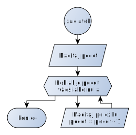

Programovanie v jazyku C

# Operácie so štruktúrami

Prednáška č. 2

Ing. Daniel Hládek PhD.

Katedra elektroniky a multimediálnych telekomunkácií

# Zápočtovka

  - Iba pre študentov PS, ma 3. cvičení

  - Programovanie na papier, príklad bude podobný ako v študijnom
    materiáli.

  - Funkcia main()

  - načítanie reťazca do premennej

  - definícia vlastnej fiunkcie s parametrami

  - volanie vlastnej funkcie s parametrami a výpis výsledku.

# Opakovanie

  - Programovanie je modelovanie reálneho sveta

  - Entitu si vieme vyjadriť pomocou sady atribútov (premenných)

  - Sadu atribútov ktoré spolu súvisia si vieme vyjadriť pomocou
    **štruktúry**.

  - Štruktúra je zložený dátový typ.

# Príklad: Telefónny zoznam

  - Načítanie zoznamu osôb

  - Zotriedenie osôb podľa veku alebo podľa priezviska

  - Zápis zotriedeného zoznamu na disk

# Outline

1.  Definícia štruktúry

2.  Inicializácia

3.  Zápis v textovom a binárnom móde

4.  Načítanie v textovom a binárnom móde

5.  Pole štruktúr

6.  Triedenie pola štruktúr

7.  Celý program

# Definícia štruktúry

# Vytvoríme nový dátový typ

Definujeme nový dátový typ

``` c
struct person {
  char name[10];
  char surname[10];
  int age;
};
```

# Vyhradenie pamäte pre štruktúru

# Vytvorenie novej hodnoty

<div class="warning">

Ak niektorý prvok zabudeme inicializovať, máme problém (a nikto nám o
tom nepovie).

</div>

``` c
struct person daniel = {
    .name = "Daniel",
    .surname = "Hladek",
    .age = 35
};
```

# Ako vyzerá štruktúra v pamäti?

    index:    .name         .surname      .age
             +--------------+-------------+---------------+
    hodnota: |     Daniel   |    Hladek   |       35      |
             +--------------+-------------+---------------+
    adresa:  #10            #20          #30         #34

# Pole štruktúr

``` c
struct person zoznam[4] = {
    {.name= "Daniel",.surname="Hladek",.age=35},
    {.name= "Jan",.surname="Hrasko",.age=101},
    {.name= "Juraj",.surname="Janosik",.age=333},
    {.name= "Martinko",.surname="Klingac",.age=99},
};
```

# Pole štruktúr v pamäti?

    index
    poľa:    0                       1
    index:    .name    .surname .age .name .surname .age
             +--------+--------+----+-----+--------+-----+
    hodnota: | Daniel | Hladek | 35 | Jan | Hrasko | 101 |
             +--------+--------+----+-----+--------+-----+

# Serializácia

# Uloženie štruktúry na disk

Využijeme to, že v súbore sú tiež údaje uložené za sebou.

1.  Zoberieme inicializovanú štruktúru v pamäti

2.  Otvoríme si súbor

3.  Zapíšeme parametre (meno, priezvisko, vek )

4.  Zatvoríme súbor

# Uloženie štruktúry na disk v textovom móde

Musme určiť, kde je hranica medzi položkami, napr. koniec riadku.

``` c
void write_person(struct person p){
  printf("%s\n",p.name);
  printf("%s\n",p.surname);
  printf("%d\n",p.age);
}
```

# Uloženie štruktúry na disk v textovom móde

Do súboru potom môžeme obsah štruktúry uložiť pomocou presmerovania
vstupu

``` bash
./mojastruktura > archiv.ludi
cat archiv.ludi
Daniel
Hladek
35
```

# Uloženie štruktúry na disk v textovom móde do súboru

Naozaj to je (skoro) to isté ako výpis na konzolu.

``` c
void write_person(FILE* f,struct person p){
  fprintf(f,"%d\n",p.name);
  fprintf(f,"%d\n",p.surame);
  fprintf(f,"%s\n",p.age);
}
```

# Uloženie štruktúry na disk v binárnom móde

Musíme použiť funkcie fread a fwrite

``` c
void write_person_binary(FILE* subor,struct person p){
  fwrite(p.name,sizeof(char[10]),1,subor);
  fwrite(p.surname,sizeof(char[10]),1,subor);
  fwrite(&(p.age),sizeof(int),1,subor);
}
```

<div class="note">

sizeof je operátor veľkosti dátového typu

</div>

## Funkcia write

    size_t fwrite(void *ptr, size_t size, size_t nmemb, FILE *stream);

1.  **ptr**: adresa v pamäti odkiaľ sa má čítať

2.  **size**: veľkosť jednej pamäťovej bunky, ktorá sa má čítať

3.  **nmemb**: počet pamäťových miest, ktoré sa majú čítať

4.  **stream**: smerník na otvorený súbor kam sa má zapisovať.

# Ako vyzerá uložená štruktúra na disku v binárnom móde

(podobne ako v pamäti, byty sú uložené za sebou)

    index:    .pocet_kolies .objem_motora .spz
             +--------------+-------------+---------------+
    hodnota: |          4   |     2048    |       KE123AB |
             +--------------+-------------+---------------+
    adresa:  \#0            \#4          \#8     \#16

# Deserializácia

# Načítanie štruktúry zo súboru v textovom móde

Na to aby sme vedeli používať štruktúru, ktorú sme si pred tým uložili,
musíme:

1.  Vyhradíme si pamäť

2.  Otvoríme si súbor

3.  Načítame parametre (meno, priezvisko, vek)

4.  Zatvoríme súbor

# Načítanie štruktúry zo súboru v textovom móde

<div class="note">

V tomto prípade netreba dávať koniec riadku do formátovacieho reťazca.

</div>

``` c
void read_person(struct person* p){
  scanf("%s",p->name);
  scanf("%s",p->surname);
  scanf("%d",&(p->age));
}
```

NOTE.speaker: Pozor na nevýhodu funkcie scanf (program sa bude správať
nepredvídateľne, ak bude zadaný súbor v nesprávnom formáte).

## Operátory pre načítanie

  - operátor `*` : získa hodnotu zo zadanej adresy

  - operátor `&` : získa adresu zadanej hodnoty

  - operátor `.` : získa hodnotu člena štruktúry

Pomocou zátvoriek musíme určit v ktorom poradí sa operácie vykonajú.

# Pre načítanie zo súboru využijeme štandardný vstup

``` bash
./mojastruktura < osoba.txt
```

# Načítanie štruktúry z disku v binárnom móde

``` c
void read_person(FILE* subor,struct person* p){
  fread(p->name,sizeof(char[10]),1,subor);
  fread(p->surname,sizeof(char[10]),1,subor);
  fread(&(p->age),sizeof(int),1,subor);
}
```

# Načítanie osôb zo súboru do poľa:

``` c
struct person telefonny_zoznam[20];
FILE* subor = fopen(argv[1],"r");
int velkost_zoznamu = nacitaj_telefonny_zoznam(subor,&telefonny_zoznam);
fclose(subor);
```

## Uloženie a načítanie poľa štruktúr



# Triedenie poľa štruktúr

# Porovnanie dvoch osôb podľa veku:

Vráti nulu, ak sú dve osoby rovnako staré.

Vráti kladnú hodnotu ak je osoba a staršia.

Vráti zápornu hodnotu ak je osoba b staršia.

``` c
int person_age_compare(struct person* a,struct person* b){
  return a->age - b->age;
}
```

# Všeobecné porovnanie dvoch osôb podľa veku

Predpis funkcie sedí na ľubovoľnú štruktúru.

Ako argument budú dve všeobecné adresy, ktorým priradíme typ neskôr.

``` c
int person_age_compare(void* a,void* b){
  struct person* osoba_a = (struct person*)a;
  struct person* osoba_b = (struct person*)b;
  return osoba_a->age - osoba_b->age;
}
```

# Triedenie poľa štruktúr

Využijeme funkciu qsort

Potrebujeme modifikovať funkciu na porovnanie.

# Binárne vyhľadávanie v poli štruktúr

Ak máme definovanú funkcu na porovnanie dvoch prvkov, tak vieme pole
prvkov ľahko triediť a aj v ňom vyhľadávať.

Funkcia bsearch má logaritmickú zložitosť.

Lineárne vyhľadávanie má lineárnu zložitosť (vždy musí prejsť všetky
prvky).

# Celý program

  - [Vstupný textový súbor](osoby.txt/highlight)

  - [Binárne osoby](binarne_osoby.c/highlight)

# Koniec
