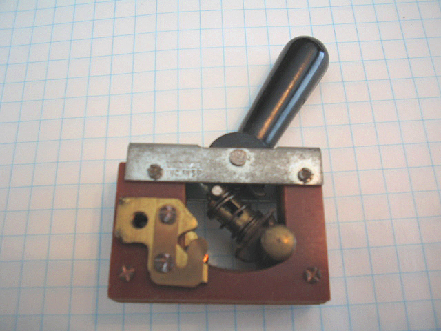

# 9\. Bitové operácie a uniony

# Binárna reprezentácia

Počítač pozná iba jednotky a nuly a operácie s nimi.

Všetky dátové typy sa dajú zapísať ako postupnosť jednotiek a núl.

# Bit

Najmenšia jednotka informácie: Zapnuté alebo vypnuté



# Bajt

Skupina 8 bitov

    +---+---+---+---+---+---+---+---+
    | 0 | 0 | 0 | 0 | 0 | 0 | 1 | 1 |
    +---+---+---+---+---+---+---+---+

Čo môže znamenať tento zápis ?

## Význam bajtu

Čokoľvek na čom sa dohodneme

# Zápis jedného bajtu

Binárny: 00010001

Osmičkový: 021

Hexadecimálny: 0x11

Decimálny: 17

# Zápis jedného bajtu

Jedna hexa cifra vyjadruje štvoricu bitov.

|     |      |      |
| --- | ---- | ---- |
| BIN | 0001 | 0001 |
| HEX | 1    | 1    |

Koľko bitov vyjadruje jedna osmičková cifra ?

# Pamäťové miesto

Skupina bajtov

Počet bajtov zistíme pomocou operátora **sizeof**

# Znamienkový bit v celom čísle

Úplne naľavo sa nachádza znamienkový bit

Reprezentácia -1:

    10000001

Pomocou **unsigned** zakážeme znamienkový bit

    unsigned int

# BitWise Demo

<http://bitwisecmd.com/>

# Bitové operácie

  - Posun \<\< \>\>

  - binárny súčin &

  - binárny súčet |

  - negácia \!

  - XOR ^

# Na čo sú dobré bitové operácie

  - Veľa bitov (príznakov) v jednom celom čísle

  - Operácie šifrovania (XOR)

# Binárny súčin &

|     |     |          |
| --- | --- | -------- |
| Op1 | Op2 | Výsledok |
| 1   | 1   | 1        |
| 1   | 0   | 0        |
| 0   | 1   | 0        |
| 0   | 0   | 0        |

# Príklad na binárny súčin

``` c
unsigned char a = 3;
unsigned char b = 1;
unsigned char c = a & b;
```

    0000011 &
    0000001 =
    -------
    0000001

# Binárny súčet |

|     |     |          |
| --- | --- | -------- |
| Op1 | Op2 | Výsledok |
| 1   | 1   | 1        |
| 1   | 0   | 1        |
| 0   | 1   | 1        |
| 0   | 0   | 0        |

# Zistenie, či je na poslednom bite nula alebo jedna

1.  Zamaskujeme všetky ostatné bity pomocou binárneho súčinu

2.  Zistíme, či nám ostala jednotka alebo nula

<!-- end list -->

``` c
unsigned char a = 3;
unsigned char mask = 1;
unsigned char val =  a & mask;
if (val){
    printf("Na poslednom mieste je jedna,\n")
}
```

# Posunutie \<\<

Reťazec bitov posunieme o n miest a doplníme nulami.

Posunutie o 2 doľava:

``` c
unsigned char a = 3;
unsigned char c = a << 2;
```

    0000011 od dva miesta doľava
    -------
    0001100

# Posunutie doprava \>\>

``` c
unsigned char a = 3;
unsigned char c = a >> 1;
```

    0000011 od jedno miesto doprava
    -------
    0000001

# Prečítanie bitov na všetkých miestach odzadu

``` c
unsigned char a = 3;
for (int i = 0 ; i < sizeof(unsigned char) * 8; i++){
    unsigned char v = a & 1;
    if (v){
        printf("1");
    }
    else{
        printf("0");
    }
    a = a >> 1;
}
printf("\n")
```

# Exkluzívny súčet XOR ^

  - Podobne ako binárny súčet, ale zanedbáme prenos

  - Vráti jedna, ak sú oba operandy odlišné

# Exkluzívny súčet XOR ^

|     |     |          |
| --- | --- | -------- |
| Op1 | Op2 | Výsledok |
| 1   | 1   | 0        |
| 1   | 0   | 1        |
| 0   | 1   | 1        |
| 0   | 0   | 0        |

# Využitie XOR v kryptografii

Vymeníme len niektoré bity podľa kľúča.

``` c
unsigned int sprava = 11;
unsigned int kluc = 22;
unsigned int tajna_sprava = sprava ^ kluc;
unsigned int povodna_sprava = tajna_sprava ^ kluc;
assert(povodna_sprava == sprava);
```

# Union

Všetky členy unionu ukazujú na to isté miesto.

``` c
union{
   unsigned int key_code;
   struct{
        int x;
        int y;
        unsigned int button_code;
   };
};
```

Veľkosť unionu je veľkosť jeho najväčšieho člena

# Polymorfizmus

Na rovnaké pamäťové mieto je možné pozerať rôznym spôsobom.

``` c
struct input_event{
    enum event_type{
        EventKeyPressed,
        EventKeyReleased,
        EventMousePressed,
        EventMouseMoved,
        EventMouseReleased
    } type;
    union{
        unsigned int key_code;
        struct{
            int x;
            int y;
            unsigned int button_code;
        };
    };
};
```

# Zaujímavosť : Bit Fields

Je možné stanoviť šírku dátového typu v bitoch

<http://en.cppreference.com/w/c/language/bit_field>

# Pomocou Bit Fields a Unionov je možný jednoduchý prístup k jednotlivým bitom

``` c
union {
    struct {
        unsigned int flag1: 1;
        unsigned int flag2: 1;
        unsigned int flag3: 1;
    };
    unsigned int flags;
};
```

Každý člen štruktúry má jeden bit.

# Bibliografia

<https://www.geeksforgeeks.org/interesting-facts-bitwise-operators-c/>

# Koniec
