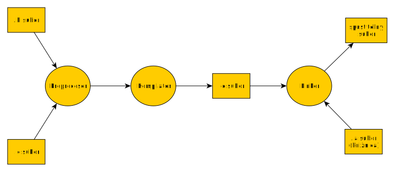

# Programovanie

Ing. Daniel Hládek PhD.

<daniel.hladek@tuke.sk>

BN32 L610

# Cieľ predmetu

  - Aby ste sa **sami** naučili programovať v jazyku C

  - a riešiť jednoduché problémy.

# Čo sa naučíte

  - Vstupno-výstupné operácie

  - Operácie s pamäťou

# Organizačné pokyny

<https://student.kemt.fei.tuke.sk/pvjc>

# Odporúčania

Pravidelná práca počas semestra je veľmi dôležitá.

# Nebojte sa opýtať

Pomôžem Vám

# Nebojte sa do toho pustiť

  - Je v poriadku, keď niečo neviete.

  - Nie je v poriadku, keď nič nespravíte.

# Nebojte sa\!

Dá sa to.

# Prečo je dôležité vedieť programovať

  - algoritmizácia problému

  - znalosť syntaxe programovacieho jazyka

  - znalosť prostriedkov, ktoré máme k dispozícii

# Musím byť programátor? Nie, ale…​

# Prvky v sieťovej infraštruktúre sú programovateľné

  - router

  - switch

  - firewall

  - server

# Programovateľné prvky v sieťovej infraštruktúre

  - Komunikujú pomocou vstupno-výstupných operácií.

  - Používajú dohodnutý spôsob komunikácie.

  - Vykonávajú algoritmy a spracúvajú dáta.

# Pre návrh siete potrebujete

  - algoritmizácia problému

  - znalosť syntaxe (konfiguračných súborov)

  - znalosť prostriedkov, ktoré máme k dispozícii

# Modulárne programovanie

# Prečo programovať modulárne?

  - Lepšia čitateľnosť  
    Súbor so zdrojovým kódom môže mať veľa riadkov a je ťažké sa v ňom
    orientovať

  - Ľahší návrh  
    Každý modul môžeme navrhnúť osobitne.

  - Ľahšie testovanie  
    Moduly môžu byť testované osobitne.

# Prečo programovať modulárne?

  - Znovupoužiteľnosť  
    Niektoré moduly môžeme použiť v iných projektoch

  - Zapuzdrenie  
    Oddelenie rozhrania a implementácie: pre "používateľa" je viditeľné
    iba rozhranie (deklarácie funkcií), ale nevidí ich definíciu.

# Modulárne programovanie v praxi

Umožňuje vytvoriť extrémne zložité projekty.

# Modulárne programovanie v praxi


# Ako programovať modulárne

  - Funkcia môže slúžiť ako "najmenšia funkčná jednotka"

  - Množina funkcií tvorí jeden modul.

  - Využijeme, že je možné oddeliť deklaráciu a definíciu funkcie.

# Funkcia

# Deklarácia a definícia

Deklarácia a definícia funkcie sú dve rozdielne veci.

| Deklarácia | Definícia                        |
| ---------- | -------------------------------- |
| **TUKE**   | Technická univerzita v Košiciach |

# Deklarácia a definícia funkcie

| Deklarácia        | Definícia                                           |
| ----------------- | --------------------------------------------------- |
| `void pozdrav();` | `void pozdrav() {
        printf("Ahoj svet\n");
}` |

# Deklarácia funkcie

Predpis fukcie:

  - Meno funkcie

  - Návratová hodnota

  - Zoznam argumentov a ich typov.

<!-- end list -->

``` c
float pow(float arg);
```

# Definícia funkcie

  - Musí vyhovovať deklarácii

  - Definuje telo funkcie

# Definícia funkcie

Funkcia môže mať nejaké vedľajšie efekty, napr. výstup na obrazovku
alebo čítanie zo súboru.

``` c
float pow(float arg){
    return arg * arg;
}
```

# Proces zostavenia programu

1.  Preprocesor - vyhodnotí direktívy preprocesora

2.  Kompilátor - skompiluje zdrojové kódy

3.  Linker - poskladá skompilované zdrojové kódy a knižnice a vytvorí
    spustiteľný súbor.

# Proces zostavenia programu



# Tvorba modulu

Pomocou preprocesora oddelíme deklaráciu a definíciu do osobitného
súboru.

matik.h

``` c
float pow(float arg);
float plus(float a,float b);
```

# Tvorba modulu

matik.c

``` c
#include "matik.h"

float pow(float arg){
    return arg * arg;
}
float plus(float a,float b);
    return a + b;
}
```

# Zabránenie viacnásobnému pripojeniu

Hlavičkový súbor by mal byť preprocesorom pripojený práve raz

Definícia sa pripojí iba vtedy ak nie je definované nejaké makro.

# Zabránenie viacnásobnému pripojeniu

``` c
#ifndef _MATIK_H
#define _MATIK_H

float pow(float arg);
float plus(float a,float b);

#endif
```

# Preprocesor pripojí hlavičkové súbory pred prekladom

    gcc -E matik.c -o matik-pre.c

``` c
float pow(float arg);
float plus(float a,float b);

float pow(float arg){
    return arg * arg;
}
float plus(float a,float b);
    return a + b;
}
```

# Vyhľadávanie hlavičkových súborov

Vyhľadáva v systémových priečinkoch

``` c
#include <stdio.h>
```

Vyhľadáva v aktuálnom adresári

``` c
#include "matik.h"
```

# Využitie modulu

1.  Pripojíme hlavičkový súbor

2.  Prilinkujeme objektový súbor

<!-- end list -->

``` c
#include "matik.h"
int main() {
    float vysledok = plus(2.0,3.0);
    printf("%f\n",vysledok);
    return 0;
}
```

# Zostavenie pomocou gcc

Pre každý zdrojový súbor: **Preprocesor a kompilátor**

    gcc -c matik.c -o matik.o
       gcc -c main.c -o main.o

Pripojí všetky hlavičkové súbory a vytvorí `.o` súbor. Vytvorenie `.o`
súboru aktivujeme prepínačom `-c`.

# Zostavenie pomocou gcc

Pre všetky objektové súbory: **Linker**

    gcc main.o matik.o -o matik

Zoberie všetky `.o` súbory a vytvorí spustiteľný súbor.

# Zostavenie pomocou make

Pre každý .c súbor definujeme pravidlo pre vytvorenie objektového
súboru.

Definujeme pravidlo pre spojenie všetkých objektových súborov.

# Pravidlo Makefile

    vysledok: predpoklady
        ako z predpokladov spravím výsledok

# Súbor Makefile

``` Makefile
all: matik

matik.o: matik.c
    gcc -c matik.c -o matik.o

main.o: main.c
    gcc -c main.c -o main.o

matik: main.o matik.o
    gcc main.o matik.o -o matik
```

# Zhrnutie

  - Vďaka modulom vieme urobiť "lepší" program.

  - Vieme využívať prácu iných ľudí vo forme knižnice.

  - Všetky funkcie v jazyku C sa nachádzajú v nejakej knižnici.
    
      - štandardná knižnica je vždy k dispozícii.

# Koniec
