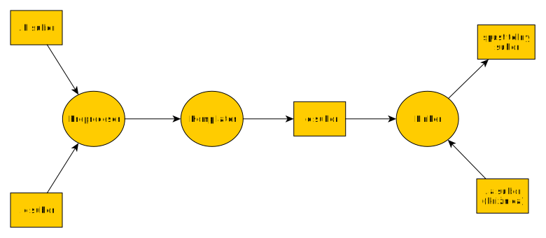

# Programovanie

Ing. Daniel Hládek PhD.

<daniel.hladek@tuke.sk>

BN32 L610

---
# Cieľ predmetu

  - Aby ste sa **sami** naučili programovať v jazyku C
  - a riešiť jednoduché problémy.

---
# Čo sa naučíte

  - Vstupno-výstupné operácie

  - Operácie s pamäťou

---
# Organizačné pokyny

https://student.kemt.fei.tuke.sk/predmety/pvjc

---
# Odporúčania

Pravidelná práca počas semestra je veľmi dôležitá.

---
# Nebojte sa opýtať

Pomôžem Vám

---
# Nebojte sa do toho pustiť

  - Je v poriadku, keď niečo neviete.
  - Nie je v poriadku, keď nič nespravíte.

---
# Nebojte sa\!

Dá sa to.

---
# Prečo je dôležité vedieť programovať

  - algoritmizácia problému
  - znalosť syntaxe programovacieho jazyka
  - znalosť prostriedkov, ktoré máme k dispozícii

---
# Musím byť programátor? Nie, ale…

---
### Prvky v sieťovej infraštruktúre sú programovateľné

  - router
  - switch
  - firewall
  - server

---
### Programovateľné prvky v sieťovej infraštruktúre

  - Komunikujú pomocou vstupno-výstupných operácií.
  - Používajú dohodnutý spôsob komunikácie.
  - Vykonávajú algoritmy a spracúvajú dáta.

---
# Pre návrh siete potrebujete

  - algoritmizácia problému
  - znalosť syntaxe (konfiguračných súborov)
  - znalosť prostriedkov, ktoré máme k dispozícii

---
# Modulárne programovanie

---
### Prečo programovať modulárne?

  - **Lepšia čitateľnosť:**  Súbor so zdrojovým kódom môže mať veľa riadkov a je ťažké sa v ňom
    orientovať
  - **Ľahší návrh:** Každý modul môžeme navrhnúť osobitne.
  - **Ľahšie testovanie:**  Moduly môžu byť testované osobitne.

---
### Prečo programovať modulárne?

  - **Znovupoužiteľnosť:** Niektoré moduly môžeme použiť v iných projektoch
  - **Zapuzdrenie:** Oddelenie rozhrania a implementácie: pre "používateľa" je viditeľné
    iba rozhranie (deklarácie funkcií), ale nevidí ich definíciu.

---
# Modulárne programovanie v praxi

Umožňuje vytvoriť extrémne zložité projekty.

---


---
### Ako programovať modulárne

- Program sa bude skladať z viacerých samostatných modulov.
- Na rôznych moduloch môžu pracovať rôzni ľudia.
- Jeden modul je v jednom súbore a skladá sa z viacerých fukcií.
- Štandardná knižnica sa skladá z viacerých modulov
- Moduly sa skladajú z viacerých funkcií

---
# Funkcia

  - Funkcia môže slúžiť ako "najmenšia funkčná jednotka"
  - Množina funkcií tvorí jeden modul.
  - Využijeme, že je možné oddeliť deklaráciu a definíciu funkcie.

---
# Deklarácia a definícia funkcie

---
# Deklarácia

Hovorí o mene funkcie, návratovej hodnote a o argumentoch.

    void pozdrav();

---
# Definícia

Hovorí o tom čo funkcia robí

    void pozdrav() {
        printf("Ahoj svet\n");
    }

---
### Využitie existujúcej funkcie 

1. Preprocesor pripojí deklaráciu funkcie - hlavičkový súbor
2. Ak to je potrebné, kompilátor skompiluje definíciu funkcie
3. Linker pripojí telo funkcie - pomocu prepínača pri zostavení

---

    program.c

```c
#include <math.h> 
#include <stdio.h> // Príkazy pre preprocesor
int main(){
    float res = pow(4.5,2.0);
    return 0;
}
```
---
# Zostavenie programu
```bash
gcc program.c -lm -o program
```

---
# Proces zostavenia programu

1.  Preprocesor - vyhodnotí direktívy preprocesora
2.  Kompilátor - skompiluje zdrojové kódy
3.  Linker - poskladá skompilované zdrojové kódy a knižnice a vytvorí
    spustiteľný súbor.

---
### Proces zostavenia programu



---
# Tvorba vlastného modulu

---

Pomocou preprocesora oddelíme deklaráciu a definíciu do osobitného
súboru.

---
## Definície

matik.h

``` c
float pow(float arg);
float plus(float a,float b);
```

---
### Zabránenie viacnásobnému pripojeniu

Hlavičkový súbor by mal byť preprocesorom pripojený práve raz.

Zabezpečíme to pomocou makra preprocesora. 

---
``` c
#ifndef _MATIK_H
#define _MATIK_H

float pow(float arg);
float plus(float a,float b);

#endif
```
---
## Definícia modulu

matik.c

``` c
#include "matik.h"

float pow(float arg){
    return arg * arg;
}
float plus(float a,float b);
    return a + b;
}
```
---
### Použitie vlastného modulu

main.c

```c
#include "matik.h" // Vyhladava v aktualnom adresari
#include <stdio.h> // Vyhladava v systmovom adresari

int main(){
    float a = 3.5;
    printf("Mocnina %f je %f\n",a,pow(a));
    return 0;
}

```

---

### Zostavenie pomocou gcc

Pre každý zdrojový súbor: **Preprocesor a kompilátor**

    gcc -c matik.c -o matik.o
    gcc -c main.c -o main.o

Pripojí všetky hlavičkové súbory a vytvorí `.o` súbor. Vytvorenie `.o`
súboru aktivujeme prepínačom `-c`.

---
### Zostavenie pomocou gcc

Pre všetky objektové súbory: **Linker**

    gcc main.o matik.o -o matik

Zoberie všetky `.o` súbory a vytvorí spustiteľný súbor.

---
### Automatické zostavenie


---
# Zostavenie pomocou make

Pre každý .c súbor definujeme pravidlo pre vytvorenie objektového
súboru.

Definujeme pravidlo pre spojenie všetkých objektových súborov.

---
# Pravidlo Makefile

    vysledok: predpoklady
        postup ako z predpokladov spravím výsledok

---
# Súbor Makefile

``` Makefile
all: matik

matik.o: matik.c
    gcc -c matik.c -o matik.o

main.o: main.c
    gcc -c main.c -o main.o

matik: main.o matik.o
    gcc main.o matik.o -o matik
```

---
# Zhrnutie

- Vďaka modulom vieme urobiť "lepší" program.
- Vieme využívať prácu iných ľudí vo forme knižnice.
- Všetky funkcie v jazyku C sa nachádzajú v nejakej knižnici.
- štandardná knižnica je vždy k dispozícii.

