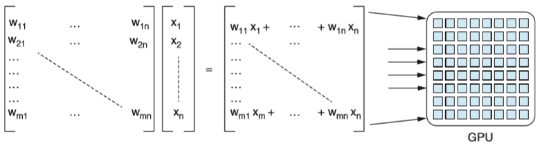

Lukáš Pokrývka, Tímový projekt 2020

Systémy na spracovanie prirodzeného jazyka (_z angl. Natural Language Processing_ – ďalej už len NLP), boli ešte v nedávnej minulosti založené na sériových algoritmoch, ktoré simulovali spôsob, ktorým ľudia čítajú text – slovo za slovom, riadok po riadku [1]. Keďže týmto štýlom boli prezentované všetky gramatické teórie, programátori ich týmto štýlom aj implementovali.

Žijeme v dobe, kedy jedno-jadrový výkon v dostupnom hardwari nemusí stačiť. Táto technológia má viacero nedostatkov, od rýchlosti prenosu dát, až po zvyšovanie nákladov, s cieľom zvýšiť rýchlosť jedno-jadrových procesorov[2]. Distribuované systémy a multi-jadrové architektúry nám dokazujú, že paralelizmus je budúcnosť výpočtovej techniky.

Paralelné spracovanie umožňuje riešiť väčšie problémy za kratší čas, čo však prináša nové problémy – správne načasovanie a spustenie programov medzi zdieľanými počítačmi a ich následná synchronizácia. Jedna z oblastí, ktorá potrebuje veľký výpočtový výkon, je NLP. Dôvod, prečo NLP vyžaduje veľký výpočtový výkon, je práca s veľkými balíkmi dát.

Poznáme dve populárne metódy, ktorými sa dá dosiahnuť vysoký výkon pre NLP. Prvou možnosťou je pridať viac grafických kariet do servera, ktorý je zodpovedný za spracovávanie, alebo prepojiť viacero serverov a tým pádom využiť dostupnosť viacerých procesorov [3]. Grafické karty sú navrhnuté paralelne spracovávať veľký počet úloh a pristupovať k veľkému objemu pamäti. Na druhej strane, čo sa týka dizajnu procesora, ktorý je jadrom každého počítača, ten bol navrhnutý tak, aby úlohy riešil sekvenčne a vysokou rýchlosťou. Kvôli tomuto dokáže pristupovať iba k obmedzenému množstvu pamäti.

Trénovaním modelov hlbokého učenia sa zistilo, že viacero operácií dokáže ťažiť z paralelného spracovania. Medzi tieto operácie patrí napríklad násobenie matíc [3]. Podobne ako grafické animácie, ktoré boli hlavným cieľom pre trh s grafickými kartami, trénovanie modelov hlbokého učenia je významne urýchlený paralelizovaním násobenia matíc.

 
_Obr._ _1. Násobenie matíc_ _[3]._

Jednotlivé jadrá grafickej karty sú v porovnaní s jadrami procesora pomalé, ale každé jadro dokáže vypočítať príslušný vektorový komponent. Keby tento výpočet prebiehal na procesore, každý riadok násobenia by sa vykonával sekvenčne. Ak by počet riadkov matice bol _n_, procesor by na výpočet rovnakej úlohy potreboval _n_-krát viacej času. Ak by sme dokázali zredukovať čas potrebný na spracovanie modelu na napríklad na jednu desatinu, v praxi by to znamenalo, že dokážeme vyskúšať desať rôznych prístupov a dosiahnuť oveľa vyššiu presnosť.

**Word embedding**

Word embedding je názov pre skupinu techník, slúžiacich na jazykové modelovanie v NLP. V tomto procese sú slová a frázy zo slovníka mapované do vektorov, ktoré majú podobu reálnych čísel. Táto technika zahŕňa premenu priestoru s viacerými dimenziami na spojitý vektorový priestor s nižším počtom dimenzií. Použitím vnorených slov a fráz ako základnou reprezentáciou vstupu bol zaznamenaný zvýšený výkon pri úlohách, ako syntaktická analýza a analýza sentimentov [4].

Word embedding je často využívaný v NLP práve pre jeho schopnosť zachytiť z vektorovej reprezentácie slov ich sémantické vlastnosti a lingvistické vzťahy medzi slovami použitím hlbokého učenia [5]. Tým pádom dokáže dať väčšiemu objemu surového textu nejaký kontext. Tým, že z textu získame kontext, sa nám otvárajú dvere pre extrakciu informácií, možnosť odpovedať na rôzne otázky, alebo textová sumarizácia. Na internete sú verejne dostupné rôzne predtrénované vnorené slová, ako napríklad Google News, alebo GloVe.

**GloVe**

Tento model kombinuje výhody dvoch najväčších rodín modelov v literatúre – maticová faktorizácia a metódy lokálneho kontextu [6]. Efektívnosť tohto modelu je dosiahnutá hlavne trénovaním iba na nenulových elementoch v maticiach, ktoré reprezentujú spoločný výskyt dvoch slov. Výstupom tohto modelu je významový vektorový priestor. Ďalšou jeho výhodou je vyšší výkon v porovnaní s modelmi založenými na podobnej technológii a to konkrétne v úlohách zameraných na podobnosť a rozpoznávanie vlastných mien.

| Pravdepodobnosť a pomer | k = pevné | k = plyn | k = voda | k = móda |
| --- | --- | --- | --- | --- |
| P(k|ľad) | 1.9 x 10^-4 | 6.6 x 10^-5 | 3.0 x 10^-3 | 1.7 x 10^-5 |
| P(k|para) | 2.2 x 10^-5 | 7.8 x 10^-4 | 2.2 x 10^-3 | 1.8 x 10^-5 |
| P(k|ľad)/P(k|para) | 8.9 | 8.5 x 10^-2 | 1.36 | 0.96 |

_Tab. 1. Pravdepodobnosti z testovacieho súboru dát_ _[7]._

Hlavná myšlienka tohto modelu vyplýva z obyčajného sledovania pomeru spoločného výskytu dvoch slov. Z toho sa usudzuje, že je z týchto slov neskôr možné vyvodiť ich význam. V tabuľke číslo jeden sa uvažuje výskyt pravdepodobností dvoch slov, ľad a para, s testovacími slovami zo slovníka. Testovací súbor dát má približne šesť miliárd slov.

Podľa očakávaní, ľad sa vyskytuje častejšie so slovom pevný (myslené skupenstvo), ako so slovom plyn. Naopak, para sa vyskytuje častejšie práve so slovom plyn, ako so slovom pevný. So slovom voda sa tieto dva slová vyskytujú približne rovnako a so slovom móda sa ich výskyt rapídne znižuje. Vďaka týmto pravdepodobnostiam vieme zhruba odhadnúť, že v testovacom súbore mali tieto slová spoločný význam viac v zmysle termodynamiky, ako v móde.

**Word2vec**

Word2vec je skupina relačných modelov, ktorá má za úlohu vytvárať word embedding. Tieto modely sú trénované na rekonštrukciu lingvistického kontextu slov. Word2vec používa veľký súbor dát ako svoj vstup a následne produkuje vektorový priestor, zvyčajne o veľkosti niekoľkých stoviek dimenzií. Každému slovu, ktoré je unikátne, je priradený prislúchajúci vektor v priestore. Ich pozícia vyplýva z ich významu, takže slová, ktoré zdieľajú podobný význam, sú uložené bližšie pri sebe.

Hlavnou výhodou tohto modelu je teda jeho schopnosť vytvárať a niesť sémantický význam, čo je veľmi užitočné pre rôzne NLP projekty [8]. Dve hlavné techniky používané v tomto modely sú _skip-gram_ a _continuous bag-of-words(CBOW)_ [9]. Tieto dva modely vytvárajú odlišne nezávislosť slov a takisto inak vnímajú podmienenosť a predpoklady. Ich spoločnou črtou je rušenie postupnosti slov, ktorá tvorí kontext vety. Sémantickú informáciu teda čerpajú z _n_-tíc slov a Word2vec zostáva naďalej populárnou voľbou z dôvodu jeho efektivity a jednoduchosti.

Hlavný rozdiel medzi syntaxou s sémantikou je, že dôležitá informácia pre syntax je rozloženie slov vo vete, kdežto sémantika vníma hlavne problém, ktoré slová patria k sebe. Keďže v modely, v ktorom je postupnosť slov zrušená, väčšina syntaktických vzťahov nedokáže byť správne interpretovaná [9].  Model CBOW je využívaný hlavne v úlohách, kedy má syntax prioritu.

**FastText**

FastText je voľne dostupná, odľahčená knižnica, určená pre word embedding a klasifikáciu textu. Bola vytvorená v laboratóriách umelej inteligencie spoločnosti Facebook. V súčasnosti obsahuje pred-trénované modely pre vyše 160 rôznych jazykov, vrátane slovenčiny [10].

Klasifikácia textu je dôležitou súčasťou NLP a to hlavne v úlohách, ako je webové vyhľadávanie, získavanie informácií, rebríčky, spam filter, alebo klasifikácia dokumentov [11]. V súčasnosti sa dostali do popredia modely na báze neurónových sietí. Napriek tomu, že tieto modely dosahujú nadpriemerné výsledky pri výkone v praktických úlohách, majú tendenciu spomaľovať pri trénovaní a testovaní. To ich limituje pri ich použití na väčších dátových súboroch. Ich hlavnou výhodou sú kompaktné veľkosti trénovacích modelov, čo je dôležité hlavne pre aplikácie, ktoré musia pracovať na zariadeniach s obmedzenou pamäťou, ako napríklad smartfóny [12].

Textové klasifikátory ako fastText zjednodušujú vývojárom vývoj rôznych nástrojov s potrebou základnej analýzy jazyka. Práve identifikovanie rôznych odkazov ako potenciálne nechcené, alebo filtrovanie spamu si vyžadujú základný jazykový model, ktorý dokáže tento jazyk správne interpretovať a kategorizovať.

V porovnaní s Word2vec bol pridaný nový algoritmus. Tento algoritmus berie do úvahy a predpovedá okolitých n-charakterov, kdežto Word2vec spracováva len okolité slová [3]. Pre slovo auto by to boli napríklad dvojice a trojice: au, aut, ut, uto, to. FastText následne vytvára vektorovú reprezentáciu pre každú takúto dvojicu, alebo trojicu. To zahŕňa aj zle napísané slová a časti slov. Výhodou tohto prístupu je, že fastText lepšie zvláda prácu so slovami s menej častým výskytom. Predtrénované modely poskytované Facebookom boli trénované iba na dostupných súboroch dát Wikipedie. To znamená, že slovník a presnosť modelov sa môžu líšiť v závislosti od jazyka.

**Zoznam použitej literatúry**

[1]. Moghrabi, C. - Moussa, S. E. - Eid, M. S. Natural language processing complexity and parallelism. IEEE: Proceedings - International Symposium on High Performance Computing Systems and Applications, 2002. 277 str.  ISBN 0-7695-1626-2.

[2]. Jos, Alexandre. Paraleliza¸c˜ao de Algoritmos de Processamento de L´ıngua Natural em Ambientes Distribu´ıdos. [Online] Instituto Superior Técnico, Universidade Técnica de Lisboa, október 2008 [cit. 08.11.2019] Dostupné na internete: \&lt;[http://www.inesc-id.pt/publications/4052/pdf](http://www.inesc-id.pt/publications/4052/pdf)\&gt;

[3]. Lane H. – Howard C. – Hapke H. M. Natural Language Processing: In Action. New York: Manning Publications Co., 2019. ISBN 9781617294631.

[4]. Socher R. – Bauer J. – Manning C. et al. Parsing With Compositional Vector Grammars. Stanford: Computer Science Department, Stanford University, 2013. ISBN 9781937284503.

[5]. Wang Y. – Liu S. – Afzal N. et al. A Comparison of Word Embeddings for the Biomedical Natural Language Processing. Rochester: Department of health Sciences Research, Mayo Clinic, 2018. ISSN 15320464.

[6]. Pennington J. – Socher R. – Manning C. GloVe: Global Vectors for Word Representation. Stanford: Computer Science Department, Stanford University, 2014. ISSN 00047554.

[7]. GloVe: Global Vectors for Word Representation. [Online]. Dostupné na internete: \&lt;[https://nlp.stanford.edu/projects/glove/](https://nlp.stanford.edu/projects/glove/)\&gt;

[8]. Rong Xin. Word2vec Parameter Learning Explained. [Online]. 2016 [cit. 10.11.2019] Dostupné na internete: \&lt;[https://arxiv.org/pdf/1411.2738.pdf](https://arxiv.org/pdf/1411.2738.pdf)\&gt;

[9]. Ling W. – Dyer C. – Black A. et al. Two/Too Simple Adaptations of Word2Vec for Syntax Problems. [online]. Lisbon: Instituto Superior Tecnico, Lisbon, Portugal, 2015 [cit. 10.11.2019] Dostupné na internete: \&lt;[https://www.aclweb.org/anthology/N15-1142.pdf](https://www.aclweb.org/anthology/N15-1142.pdf)\&gt;

[10]. fastText: Library for efficient text classification and representation learning. [Online]. Dostupné na internete: \&lt;[https://fasttext.cc/](https://fasttext.cc/)\&gt;

[11]. Joulin A. – Grave E. – Bojanowski P. et al. Bag of Tricks for Efficient Text Classification. [Online]. 15th Conference of the European Chapter of the Association for Computational Linguistic, EACL 2017 [cit. 11.11.2019] Dostupné na internete: \&lt;[https://arxiv.org/pdf/1607.01759.pdf](https://arxiv.org/pdf/1607.01759.pdf)\&gt;

[12]. Joulin A. – Grave E. – Bojanowski P. et al. FastText.zip: Compressing Text Classification Models. [Online]. ICLR, 2017. [cit. 11.11.2019] Dostupné na internete: \&lt;[https://arxiv.org/pdf/1612.03651.pdf](https://arxiv.org/pdf/1612.03651.pdf)\&gt;
