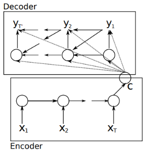
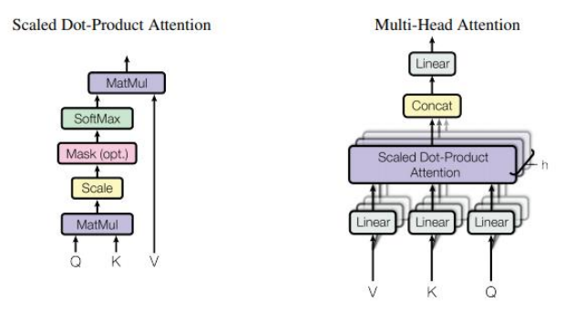
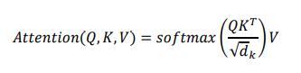

Tímový projekt 2020, Dominik Nagy

Hlboké neurónové siete (Deep Neural Networks – DNN) sú veľmi výkonné modely strojového
učenia, ktoré sú určené na riešenie zložitých problémov, ako je rozpoznávanie reči či vizuálnych objekov.
Hlboké neurónové siete môžu vykonávať ľubobovoľný paralelný výpočet na malý počet krokov. Veľké
DNN môžu byť trénované pokiaľ máme dostupné obrovské množstvo dát. Napriek svojej flexibilite a sile,
hlboké neurónové siete sa dajú aplikovať iba na problémy, ktorých vstupy môžu byť rozumne kódované
vektormi s fixným rozmerom. [1]

Sequence-to-sequence alebo postupnosť sekvencií je o trénovaní modelov na konverziu z jednej
domény na sekvencie do inej doméne ako napríklad preloženie viet z angličtiny do slovenčiny.
Postupnosť sekvencií mapuje jednu sekvenciu neurčenej dĺžky na inú sekvenciu, ktorej dĺžka je tiež
neznáma. [2]

Rekurentná Neurónová Sieť (po anglicky Recurrent Neural Network, ďalej už len RNN) je prirodená
generalizácia dopredných neurónových sietí pre sekvencie. Postupnosť vstupu (x 1 ,...,xT), štandardné RNN
vypočíta postupnosť výstupov (y 1 ,...,yT) iteráciu nasledujúcich rovníc:

### ℎ𝑡 = 𝑠𝑖𝑔𝑚(𝑊ℎ𝑥𝑥𝑡 + 𝑊ℎℎℎ𝑡−1)

### 𝑦𝑡 = 𝑊𝑦ℎℎt

RNN môže ľahko mapovať sekvencie na sekvencie vždy, keď je zarovnanie medzi vstupmi výstupmi
známe vopred. Nie je však jasné, ako aplikovať RNN na problémy, ktorých vstupné a výstupné sekvencie
majú rôzne dĺžky s komplikovanými a nemonotonickými vzťahmi. Najjednoduchšia stratégia pre
všeobecné sekvenčńé učenie je mapovať vstupnú sekvenciu na vektor s pevnou veľkosťou pomocou
jedného RNN a potom mapovať vektor na cieľovú sekvenciu s iným RNN.[2] [3]

## Convolutional neural networks

Konvolučné neurónové siete sú menej bežné pre sekvenčné modelovanie, napriek niekoľkým výhodám.
V porovnaní s opakujúcimi sa vrstvami, konvolácie vytvárajú reprezentáciu pre kontexty s pevnou
veľkosťou, avšak efektívna veľkosť kontextu siete sa dá ľahko zväčšiť naskladaním niekoľkých vrstiev na
seba. To umožňuje presne ovládať maximálnu dĺžku závislostí, ktoré sa majú modelovať. Konvolučné
siete nezávisia od výpočtov predchádzajúceho časového kroku, a preto umožňujú paralelizáciu nad
každým prvkom v sekvencii. Tento kontrast v RNN, ktorý udržiava skrytý stav celej minulosti, zabraňuje
paralelnému výpočtu v danej sekvencii [4]

# Encoder-decoder

Hlboké neurónové siete preukázali veľký úspech v rôznych aplikáciách, ako napríklad
rozpoznávanie objektov alebo rozpoznávanie reči. Nedávno sa objavil nový prístup k štatistickému
strojovému prekladu založený na neurónových sieťach. Tento nový prístup je inšpirovaný podľa
nedávneho trendu hlbokého reprezentatívneho učenia. Všetky modely neurónovej siete použité v [5]
pozostávajú z kódera a dekódera (encoder, decoder) Kóder extrahuje vektor s pevnou dĺžkou
reprezentujúce z vety s premenlivou dĺžkou a z tohto znázornenia dekóder generuje správny cieľový
preklad s premenlivou dĺžkou. Model neurónového strojového prekladu vyžaduje iba zlomok pamäte,
ktorú potrebuje model tradičného strojového prekladu. [6][7]

 
 
1 Ilustrácia RNN Encoder-Decoder [5]

# Transformer a Attention

Opakujúce sa seq2seq modely, ktoré používajú encoder-decoder architektúru dosiahli veľký
pokrok v rozpoznávaní reči. Avšak, majú nevýhodu v rýchlosti tréningu. Vnútorné opakovanie obmedzuje
parareliláziu tréningu. Neopakujúci sa seq2seq model nazývaný Transformer sa spolieha na mechanizmy
Attention, aby sa naučil pozičným závislostiam, ktoré je možné trénovať rýchlejšie s väčšou
účinnosťou.[8] Attention model sa nesnaží preložiť vetu naraz, preklad prebieha postupne, preloží najprv
jednu časť vety a potom pokračuje na ďalšiu casť, ako človek.

Attention model by sa dal vysvetliť ako funckiu, ktorá mapuje dopyt a sadu páru kľúč-hodnota na výstup,
kde dopyt, hodnoty, kľúče a výstup sú vektory. Výstup sa počíta ako vážená suma (weighted sum)
hodnôt, kde váha priradená každej hodnote sa vypočíta poďla funcie kompatibility dopytu so
zodpovedajúcim kľúčom.[9]

2 Scaled Dot-Product Attention a Multi-Head attention

## Scaled Dot-Product Attention

Vstup pozostáva z dopytov a kľúčov rozmeru _dk_ a hodnôt rozmerov _dv._ Vypočítajú sa „dot products“
všetkých dopytov s kľúčmi, vydelia sa s _√dk_ a použije sa funkcia „softmax” na získane váhy hodnôt. [9]

## Multi-Head Attention

Silnou stránkou Multi-Head Attentionu je schopnosť spoločne sa venovať informáciám z rôznych
reprezentačných podpriestorov na rôznych pozíciách.[10] [9]

### 𝑀𝑢𝑙𝑡𝑖𝐻𝑒𝑎𝑑(𝑄,𝐾, 𝑉) = 𝐶𝑜𝑛𝑐𝑎𝑡(ℎ𝑒𝑎𝑑1, … , ℎ𝑒𝑎𝑑ℎ)𝑊O

### 𝑤ℎ𝑒𝑟𝑒 ℎ𝑒𝑎𝑑𝑖 = 𝐴𝑡𝑡𝑒𝑛𝑡𝑖𝑜𝑛(𝑄𝑊𝑖𝑄,𝐾𝑊𝑖K,𝑉𝑊𝑖V)

# Zoznam použitej literatúry

[1] I. Sutskever Google, O. Vinyals Google, and Q. V Le Google, “Sequence to Sequence Learning with
Neural Networks.”

[2] M. P. For, “Natural Language Processing in Action,” _Online_ , vol. 80, no. 1. p. 453, 2017.

[3] “Sequence to Sequence Learning with Neural Networks – arXiv Vanity.” [Online]. Available:
https://www.arxiv-vanity.com/papers/1409.3215/. [Accessed: 20-Dec-2019].

[4] J. Gehring, M. Auli, D. Grangier, D. Yarats, and Y. N. Dauphin, “Convolutional Sequence to
Sequence Learning.”

[5] K. Cho _et al._ , “Learning phrase representations using RNN encoder-decoder for statistical
machine translation,” in _EMNLP 2014 - 2014 Conference on Empirical Methods in Natural
Language Processing, Proceedings of the Conference_ , 2014, pp. 1724–1734.

[6] R. Pascanu, T. Mikolov, and Y. Bengio, “On the difficulty of training recurrent neural networks,” in
_30th International Conference on Machine Learning, ICML 2013_ , 2013, no. PART 3, pp. 2347–
2355.

[7] K. Cho, B. Van Merriënboer, D. Bahdanau, and Y. Bengio, “On the Properties of Neural Machine
Translation: Encoder-Decoder Approaches.”

[8] L. Dong, S. Xu, and B. Xu, _SPEECH-TRANSFORMER: A NO-RECURRENCE SEQUENCE-TO-SEQUENCE
MODEL FOR SPEECH RECOGNITION_..

[9] A. Vaswani _et al._ , “Attention Is All You Need.”

[10] J. Li, Z. Tu, B. Yang, M. R. Lyu, and T. Zhang, “Multi-Head Attention with Disagreement
Regularization.”

