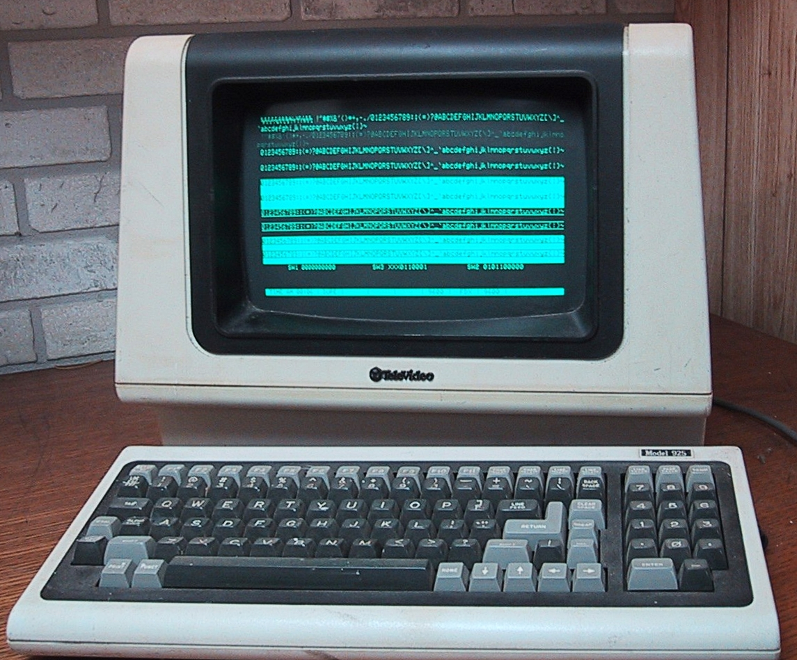

# 11\. Vstup a výstup

# IO Zariadenia

  - Klávesnica

  - Pevný disk

  - Flash alebo SSD pamäť

  - **Sieťová karta**

  - Zvuková karta

  - iné

# Prečo je dôležité pracovať s IO zariadeniami?

To je to, čo počítač robí.

1.  Načíta vstup zo vstupu.

2.  Spracuje ho.

3.  Zapíše výsledok na výstup.

# Možné chyby pri vstupe

  - Bola zadaná iná ako očakávaná hodnota

  - Vstup nikdy nenastal

  - Nastal koniec vstupu

  - Nastala predčasná chyba čítacieho zariadenia

# Vstup (a výstup) je nespoľahlivý

  - Kedy? Chceme čakať na vstup do nekonečna?

  - Čo? Uspokojíme sa aj s nedokonalým vstupom?

  - Kam? Budeme mať dosť prostriedkov pre spracovanie vstupu?

# Všetko je súbor

  - Vstup je prúd bajtov.

  - Práca so vstupom a výstupom je veľmi podobná na rôznych
    zariadeniach:
    
      - terminál
    
      - súbor
    
      - sieťová karta

# Súbor je ako papierová páska

# Príkazy pre čítaciu alebo zapisovaciu hlavu

  - čítaj (jeden alebo viac bajtov).

  - zapíš (jeden alebo viac bajtov).

  - choď na iné miesto (dá sa iba pri súborovom systéme).

# Práca s terminálom



# Práca s terminálom

  - getchar()  
    načítaj bajt (z klávesnice).

  - putchar()  
    zapíš bajt (na obrazovku terminálu).

# Možné chyby

  - nekonečné čakanie na vstup (zatiaľ necháme tak).

  - už sa nedá načítavať (spojenie sa stratilo).

  - nedá sa ani zapisovať

# Príklad na spracovanie znakov z terminálu:

``` c
int counter = 0;
while(1){
   int c = getchar();
   if (c == EOF){
        break;
   }
   counter += 1;
   int r = putchar(c);
   if (r == EOF){
        exit(1);
   }
}
```

# Načítanie zo súboru

Čítaciu alebo zapisovaciu hlavu nám bude reprezentovať premenná typu
`FILE*`.

Tejto premennej "posielame" príkazy:

  - fopen()  
    zapni "magnetofón"

  - fclose()  
    vypni "magnetofón"

  - fgetc()  
    načítaj bajt.

  - fputc()  
    zapíš bajt.

# Príklad na načítanie zo súboru

``` c
FILE* file = fopen("subor.txt","r");
int c = fgetc(file);
if (c == EOF){
    printf("Koniec\n");
}
fclose(file);
```

# Terminál je otvorený súbor

Máme k dispozícii globálnu premennú stdin.

``` c
int c = fgetc(stdin);
if (c == EOF){
    printf("Koniec\n");
}
```

# Načítanie zo súboru alebo klávesnice

Je rovnaké \!

# Načítanie zo súboru po slovách

# Načítanie zo súboru po riadkoch

# Načítanie s ošetrením

# Načítanie z socketu

# Kontrola - Zadanie

  - Načítaj práve 10 celých čísel.

  - Zisti minimum a maximum.

  - Vypočítaj priemer so všetkých čísel, ktoré nie sú minimum ani
    maximum.

  - Ak sú všetky čísla minimum alebo maximum vráť tie, ktorých je viac

  - Ak je miním a maxím rovnako, vráť maximum.

Premenná

Podmienka

Cyklus

Načítanie pomocou getchar()

Výpis jedného znaku

Výpis viacerých znakov

Výpis znakov s formátovaním

Reťazec

(Je zakončený nulou).

# Ošetrenie vstupu
