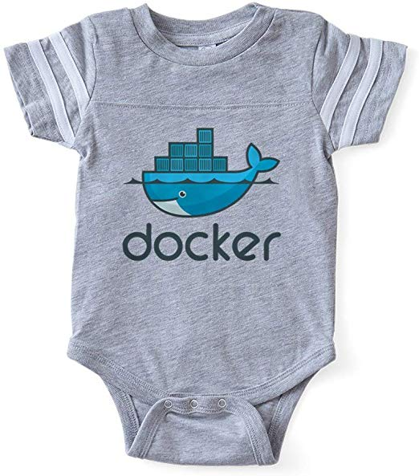

---
published:false
---
# Aplikačný kontajner

---
### Na čo je to dobré?

Aplikačné kontajnery  a cloud computing znižujú náklady

---
### Celkové náklady na vlastnenie infraštruktúry

- cena servra
- cena serverovne
- plat administrátora
- plat developera
- náklady na energie
- náklady na údržbu

---
## Čo je lepšie?

- vlastná serverovňa: Private Cloud (On premise)
- Google/Microsoft/Amazon dátové centrum: Public Cloud
- časť doma, časť inde: Hybrid Cloud

---
## Public Cloud

- Časť zodpovedností sa deleguje na špecializovanú firmu
- servery vo veľkom

---
## Private Cloud

Viac servrov manažujeme ako jeden systém.

---
## Private Cloud

Vytvorí sa "pool zdrojov"

- sieť
- storage
- CPU
- GPU

---
## Ako upraviť aplikáciu aby bežala na cloude?

- Oddelenie aplikácie, dát, siete a konfigurácie.
- Vytvorenie tenkej vrstvy medzi aplikáciou a operačným systémom.

---
## Docker



---
## Docker 

Virtualizačná vrstva medzi aplikáciou a operačným systémom

Aplikácia využíva jadro hostiteľského OS

---
## Docker

Umožňuje rýchlo spúšťať aplikáciu na ľubovoľnom uzle
bez toho aby ste museli riešiť inštaláciu a závislosti.

---
## Docker Komponenty

- docker client
- docker démon
- image registry

---
## Docker Komponenty

```
      +----------+
      | registry |   Docker Hub
      +----------+
           ||         (image)
      +----------+
      |   démon  |   Host machine
      +----------+
           ||         (protocol)
      +----------+
      |   client |   Host machine
      +----------+
```

---
# Docker client

Príkaz 'docker' v príkazovom riadku

- beží na ľubovoľnom OS
- pomocou vlastného protokolu komunikuje s docker démonom

---
# Docker démon

- (väčšinou) beží na Linux OS alebo na Docker Machine
- stará sa o bežiace kontajnery

---
## Obraz


---
## Obraz

Pripravená aplikácia

---
## Vytvorenie obrazu


Dockerfile sú inštrukcie ako zostaviť obraz

---
## Zdieľanie obrazu


Centrálny repozitár  Dockerhub

---
## Kontajner


---
## Kontajner

Bežiaca aplikácia

---
## Spustenie Docker kontajnera

    docker run nginx


---
## Interaktívne spustenie

    docker run -it --rm nginx

---
## Virtuálna sieť

Kontajner vidí "svoju" sieť.

- Docker podporuje "software defined networking".

---
## Virtuálny súborový systém

- Kontajner vidí svoj vlastný súborový systém

---
## Oddelenie dát od aplikácie

- Aplikácia nemá svoj stav
- Dáta môžu byť uložené [kdekoľvek](https://docs.docker.com/engine/extend/legacy_plugins/#finding-a-plugin)

---
## Spustenie s mapovaním siete a zväzkov

    docker run  -p 80:80 -v /var/www:/var/www nginx

Mapovanie medzi reálnym a virtuálnym adresárom.

---
## Možné problémy

- Závisloť na Docker Hub
- Časté využívanie neoverených obrazov
- docker démon beží ako 'root'

---
## Docker

- je virtualizačná vrstva medzi jadrom a aplikáciou
- umožňuje ľahko spustiť aplikáciu v cloude
- zjednodušuje inštaláciu
