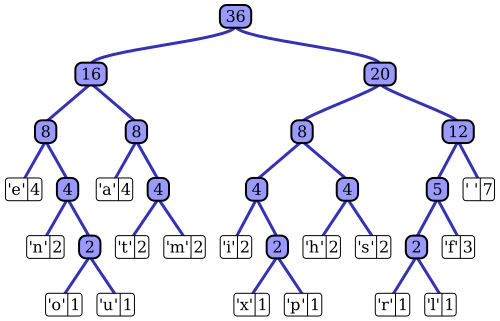

# 9. Kompresia a Huffmanovo kódovanie
:stem: latexmath
:source-highlighter: highlightjs

## Kompresia a Huffmanovo kódovanie

## Problém komunikácie

    Vysielač -- prenosový kanál --> Príjmač

Ako navrhnúť efektívnu  komunikáciu z vysielača tak, aby jej príjmač porozumel?

### Fundamental problem of communication

[quote, Shannon]
> fundamental problem of communication" is for the receiver to be able to identify what data was generated by the source,
> based on the signal it receives through the channel.

## Teória informácií

Dáta sú množina prvkov (udalostí), ktoré sa môžu opakovať.

    [1,2,2,4,5,7,7,7]

## Teória informácií

Je možné vypočítať pravdepodobnosť každého prvku.
Pravdepodobnosť je priamo úmerná početnosti:

    1: 1
    2: 2
    4: 1
    5: 1
    7: 3
    ostatné: nula

## Kódovanie

Spôsob zápisu množiny prvkov.

    [1,2,2,4,5,7,7,7]

- Ako by sme zapísali v binárnom kóde túto množinu čo najefektívnejšie?
- Koľko bitov budeme potrebovať?

## Optimálne kódovanie

Najčastejšie symboly by mali mať čo najkratšie kódy.

## Kódovanie

    [1,2,2,4,5,7,7,7]

- ASCII kódovanie potrebuje 8 bitov na jeden znak
- Mohli by sme sa dohodnúť na nejakom inom kódovaní?

## Kódové slovo

- Unikátny spôsob zápisu jedného prvku

## Entropia

Minimálne množstvo bitov, potrebné na reprezentáciu jedného prvku `z`:

	S(z) = -  \log_2 P(z)

---
## Entropia

Minimálne množstvo bitov, potrebné na reprezentáciu celej množiny stem:[Z, z \in Z].

	S(Z) = - \sum_z P(z) \log_2 P(z)

---
## Kompresia

Hľadanie optimálnej sady kódových slov.

Zníženie počtu bitov potrebných na reprezentáciu dát.

Entropia:: Teoreticky maximálna kompresia.

---
## Compression

> Data compression is the process of reducing the number of bits used to represent 
data.
> Data compression entails two processes: in one process the data is compressed, or encoded, to reduce its size; in a second process it is uncompressed, or decoded, to
> return it to its original state.

---
## Kompresia

Stratová a bezstratová

---
## Stratová kompresia

Vynechanie nepodstatných častí. Nie je možná dekompresia do pôvodnej podoby.

- kompresia audia
- kompresia videa

---
## Bezstratová kompresia

Zmena spôsobu zápisu informácie, Zníženie redundancie v dátach.

Je možné obnovenie do pôvodnej podoby.

- šifrovaný prenos.
- archivovanie súborov.

---
## Bezstratová kompresia

Premenlivá dĺžka kódového slova:: Kóduje často opakujúce sa sekvencie s menším počtom bitov
Fixná dĺžka kódového slova:: Kóduje dáta ako tokeny 

---
## Prefixové kódovanie

Žiadne kódové slovo nie je prefixom iného kódového slova.

---
## Huffmanovo kódovanie

Hľadanie optimálneho prefixového kódovania.

---
## Huffmanov strom

- Všetky symboly sa dajú zoradiť do binárneho stromu podľa ich binárneho kódu.
- Cesta k uzlu je jeho binárny kód.

---
## Huffmanov strom

---
## Huffmanovo kódovanie

- Vstup:: Množina symbolov a ich váhy (početnosti).
- Výstup:: Množina binárnych kódov pre každý symbol usporiadaná v Huffmanovom strome.

---
## Tvorba Huffmanovho stromu

1. Zostav tabuľku početností symbolov
2. Symbol a početnosť premeň na uzol binárneho stromu a ulož do prioritnej fronty.

---
## Tvorba Huffmanovho stromu

3. Ak je vo fronte dosť prvkov, vytvor nový uzol. vyber dva najmenej početné prvky a tie budú potomkami nového uzla.. Početnosť nového uzla bude súčet početností potomkov.
4. Ak nie je vo fronte dosť prvkov, zvyšný uzol je koreňom binárneho Hufmanovho stromu.

---
## Huffmanovo kódovanie

Každému symbolu sa priradí jeho Huffmanov kód.

---
## Huffmanovo dekódovanie

- Vstup:: Binárny reťazec a Hufmannov strom.
- Výstup:: Postupnosť symbolov

---
## Zhrnutie: Ako súvisí kompresia a údajové štruktúry a algoritmy

- Hufmanov strom je binárny strom
- binárna kopa sa využíva pri zostavení Hufmannovho stromu.

