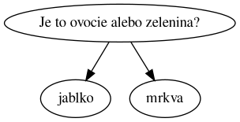
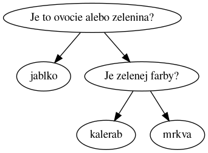
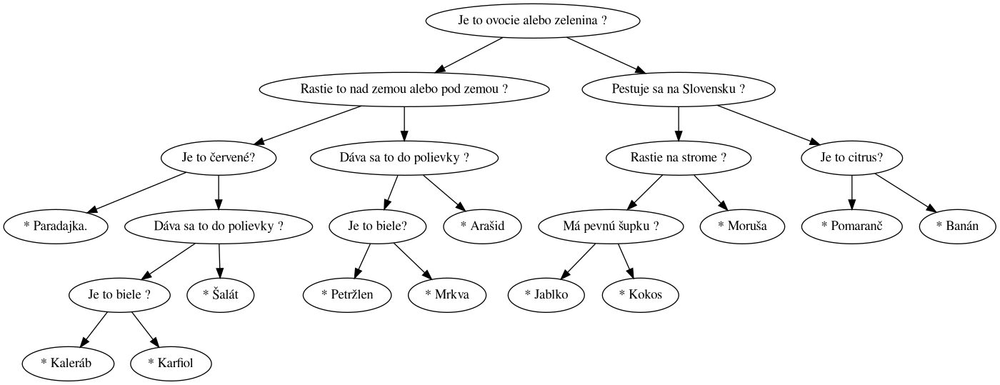

## Expert z bufetu

Je to ovocie alebo zelenina? Nad touto otázkou si lámali hlavu celé generácie najlepších  mozgov z celého sveta. Vedenie Technickej univerzity si v nasledovnej päťročnici naplánovalo vyskúmať konečnú odpoveď na problém klasifikácie tovaru v oddelení Ovocia a zeleniny v sklade Študentských domovoch a jedální.
Nový spôsob rozdelenia tovaru bude vyskúšaný v novom bufete "Aninelez" (pravdepodobne v budove TaHni-Com).

Pomôžte pracovníkom v školskom bufete. Pri identifikácii tovaru pomôže pracovníkom bufetu Váš automatický dialógový systém, a.k.a chatbot.  Je dôležité, aby výsledok bol čo najlepší, pretože konkurzu na túto pozíciu v novom bufete sa môžete zúčastniť aj VY!

## Ciele

- Práca s jednoduchým znalostným systémom.
- Práca s nevyváženým vyhľadávacím stromom.
- Prechádzanie binárneho stromu spôsobom preorder a postorder.

## Binárny vyhľadávací strom

Binárne stromy sú zovšeobecnenie spojkových zoznamov.  Každý uzol binárneho vyhľadávacieho stromu má namiesto jedného smerníka na ďalší prvok až dva smerníky. Vďaka tomu je vhodný na reprezentáciu informácií ktoré majú hierarchický charakter - napr. sada otázok v znalostnom systéme. Ak na každú otázku sú iba dve možné odpovede, tak je možné ich zoradiť do štruktúry podobnej stromu. Na začiatku (v koreňovom uzle) bude uložená prvá otázka.  Všetky ďalšie otázky budú uložené v podradených stromoch. Otázka sa zobrazí podľa toho, ako používateľ odpovedá ,

V binárnom vyhľadávacom strome poznáme dva druhy uzlov: vnútorný (nelistový) uzol a listový uzol. Listový uzol je taký, ktorý neobsahuje odkazy na žiadne ďalšie uzly. Vnútorný uzol obsahuje odkazy na iné listové alebo nelistové uzly. V našom znalostnom systéme sú nelistové uzly otázky a listové uzly finálne rozhodnutia znalostného systému.


```c
struct tree {
   // Otázka aleo odpoveď
   char value[SIZE];
   // Odpoveď áno
   struct tree* left;
   // Odpoveď nie
   struct tree* right;
};
```

Smerníky `left` alebo `right` hovoria, čo má chatbot radiť ak používateľ odpovie na otázku áno (left) alebo nie (right).

Prvú otázku si vytvorím klasickým spôsobom. Ak sú oba smerníky nulové, ide o listový uzol.

```c
struct tree* chatbot = calloc(1,sizeof(struct tree));
strcpy(chatbot->value,"Je to ovocie alebo zelenina?");
```

Do ľavého a do pravého podstromu si môžme uložiť ďalšie otázky alebo odpovede.  Ak chceme rozlišovať medzi dvoma druhmi ovocia a zeleniny, poznačíme si ich do listových uzlov a tie napojme na koreňový uzol. Takto zmeníme listový uzol na vnútorný a na otázku napojíme odpovede.

```c
struct tree* mrkva = calloc(1,sizeof(struct tree));
strcpy(mrkva->value,"*Mrkva");
struct tree* jablko = calloc(1,sizeof(struct tree));
strcpy(mrkva->value,"*Jablko");

chatbot->left = jablko;
chatbot->right = mrkva;
```

Výsledný strom bude vyzerať nejako takto:



Ak chceme rozlišovať medzi troma druhmi ovocia alebo zeleniny, musíme na vhodné miesto vložiť ďalšiu otázku:

```c
struct tree* mrkva = calloc(1,sizeof(struct tree));
strcpy(mrkva->value,"*Mrkva");
struct tree* kalerab = calloc(1,sizeof(struct tree));
strcpy(mrkva->value,"*Kalerab");
struct tree* jablko = calloc(1,sizeof(struct tree));
strcpy(mrkva->value,"*Jablko");
struct tree* zelena = calloc(1,sizeof(struct tree));
strcpy(zelena->value,"Je zelenej farby?");

chatbot->left = jablko;
chatbot->right = zelena;
zelena->left = kalerab;
zelena->right = mrkva;
```

Vznikne  nám toto:



## Úloha

Vašou úlohou bude naprogramovať chatbota, ktorý pomôže budúcim zamestnancom bufetu pri rozlišovaní druhov tovaru pomocou série otázok. Báza znalostí sa skladá z otázok typu áno a nie a odpovedí.

Systém najprv načíta bázu otázok a odpovedí. Každá otázka alebo odpoveď sa nachádza na práve jednom riadku. Odpovede sú vyznačené hviezdičkou na začiatku riadka. Po otázke na najprv nasleduje načítanie ďalšieho kroku áno a potom kroku nie.
Každý krok znalostného systému je alebo odpoveď alebo ďalšia otázka. Báza pravidiel je ukončená prázdnym riadkom.

Otázky a odpovede spolu tvoria binárny vyhľadávací strom zapísaný vo formáte pre-order.

Príklad bázy pravidiel s dvoma otázkami a troma druhmi tovaru:

    Je to ovocie alebo zelenina ?
    * Jablko
    Je to zelenej farby ?
    * Kaleráb
    * Mrkva

Po načítaní bázy pravidiel vypíšte počet tovarov v báze pravidiel. V prípade, že sa nedá správne načítať báza pravidiel vypíšte chybové hlásenie. Báza pravidiel je od používateľského vstupu oddelená prázdnym riadkom.

Ak sa bázu pravidiel podarilo načítať, spustite znalostný systém prvou otázkou. Spustenie znalostného systému znamená jeho rekurzívne prechádzanie typu preorder od koreňového uzla. Pri prechádzaní najprv zobrazte otázku alebo odpoveď ktorá sa nachádza v aktuálnom uzle. Ďalšie otázky alebo odpovede zobrazujte podľa toho, či používateľ odpovedá `a` pre prvú
možnosť  alebo `n` pre druhú. Ak systém nájde odpoveď, vypíšte správu a skončite program. Ak používateľ zadá nesprávny vstup, vypíšte správu a skončite program.

Príklad vstupu:

	Je to ovocie alebo zelenina (a/n) ?
	* Jablko
	* Mrkva
	
	n


Príklad výstupu:

	MUDrC to vie.
	Pozna 2 druhov ovocia a zeleniny.
	Odpovedajte 'a' alebo 'n'
	Je to ovocie alebo zelenina (a/n) ?
	* Mrkva
	Koniec


## Budete potrebovať

Budete potrebovať ovládať základy spojkových zoznamov.
Inak nebudete potrebovať žiadne špeciálne knižnice, len štandardné na:

- prácu s reťazcami 
- prácu so vstupom a výstupom
- prácu s pamäťou

## Ako na to

Na návrh a implementáciu znalostného systému, ktorý bude vedieť odpovedať na otázky typu áno a nie je vhodný binárny vyhľadávací stom.  Na uloženie jednej položky databázy budete potrebovať tieto položky:

- Znenie otázky alebo odpovede
- Smerník na odpoveď áno
- Smerník na odpoveď nie

V prípade, že sú smerníky na áno a nie nulové, uzol je listový a naznačuje konečnú odpoveď znalostného systému.

### 1. Načítanie bázy pravidiel zo súboru do binárneho stromu

Vzorovú znalostnú databázu vieme zapísať do textového súboru takto:

```
Je to ovocie alebo zelenina ?
Rastie to nad zemou alebo pod zemou ?
Je to červené?
* Paradajka.
Dáva sa to do polievky ?
Je to biele ?
* Kaleráb 
* Karfiol
* Šalát
Dáva sa to do polievky ?
Je to biele?
* Petržlen
* Mrkva
* Arašid
Pestuje sa na Slovensku ?
Rastie na strome ?
Má pevnú šupku ?
* Jablko
* Kokos
* Moruša
Je to citrus?
* Pomaranč
* Banán
```


Pri načítavaní postupujeme metódou preorder:

1. Najprv načítame hodnotu. (Názov otázky alebo ovocia). Prípade, že sa názov začína na '*', tak je uzol listový a potomkov ďalej nemusíme načítavať.
1. Potom načítame ľavý uzol, ktorý zodpovedá prvej odpovedi.
1. Potom potom načítame pravý uzol (druhá odpoveď).

Výsledný binárny strom pre vzorovú databázu  bude vyzerať takto:



Najprv si vytvorte funkciu, ktorá načíta bázu pravidiel s jednou otázkou.


```c
struct tree* read_tree(){
    char buffer[SIZE];
    memset(buffer,0,SIZE);
    char* r = fgets(buffer,SIZE,stdin);
    assert(r);
    struct tree* node = calloc(1,sizeof(struct tree));
    memcpy(node->value,buffer,SIZE);
    return node;
}
```

Nezabudnite dynamicky alokovanú pamäť uvoľniť:

```c
void destroy_tree(struct tree* tree){
    free(tree);
}
```


Ďalej si skúste funkciu pre vytvorenie stromu zovšeobecniť tak, aby načítala ľubovoľnú databázu. Môžete to navrhnúť ako rekurzívnu funkciu. Využijeme fakt, že načítať jeden riadok už vieme. Načítavať sa bude podľa pravidiel preorder, teda najprv ide otázka, potom odpoveď áno a potom nie. Ak sa riadok začíta symbolom `*`, nebude potrebné načítať ďalšie otázky na nižšej úrovni. V prípade, že sa riadok nezačína symbolom `*`, rekurzívne načíta ľavého a pravého syna, ktoré sa nachádzajú na ďalších riadkoch. Ľavý syn bude obsahovať, to čo sa má diať po odpovedi "áno", pravý syn bude obsahovať to, čo sa bude diať po odpovedi "nie".

```c
struct tree* read_tree(){
    char buffer[SIZE];
    memset(buffer,0,SIZE);
    char* r = fgets(buffer,SIZE,stdin);
    assert(r);
    struct tree* node = calloc(1,sizeof(struct tree));
    memcpy(node->value,buffer,SIZE);
    // Ak je nacitany riadok listovy uzol ,tak netreba robit nic
    // inak rekurzivne nacitanie laveho syna
    // a rekurzivne nacitanie praveho syna
    return node;
}
```


Báza pravidiel je od používateľského vstupu oddelená prázdnym riadkom.  Po načítaní stromu a pred začiatkom spracovania vstupu od používateľa je potrebné overiť, či sa tam ten prázdny riadok nachádza. Ak nie, tak niečo nie je v poriadku.

Upravte aj funkciu pre uvoľnenie pamäte tak aby uvoľnila celý binárny strom. Inšpirujte sa funkciou pre uvoľnenie spojkového zoznamu. 

Pri ladení môžte využiť aj rekurzívnu funkciu pre vizualizáciu binárneho stromu. Táto funkcia zároveň demonštruje preorder prechádzanie binárneho stromu ktoré využijete pri načítaní. Najprv sa vypíše otázka alebo odpoveď a ak existujú podstromy, tak výpis rekurzívne pokračuje na ľavý a pravý podstrom.

Táto funkcia vypíše každú úroveň stromu s väčším odsadením. Výpis stromu v textovom formáte:

```c
void print_tree(struct node* tree,int offset){
    for (int i = 0; i < offset; i++){
        printf(" ");
    }
    printf("%s",tree->question);
    if (tree->left){
        print_tree(tree->left,offset +3);
        print_tree(tree->right,offset +3);
    }
}
```


Ak máte na nainštalovaný balíček GraphViz, môžete si vytvoriť aj pekný obrázok stromu. Ak program na štandardný výstup vygeneruje zápis grafu v jazylu `dot`, potom obrázok dostaneme:

```
program | dot -T png -o obrazok.png
```

Podmienkou je ale aby každý uzol mal svoj unikátny identifikátor `id`. Ten pridáme počas načítania stromu podľa počítadla.

Aby sme pri rekurzívnej funkcii mohli používať počítadlo bez globálnej premennej musíme použiť smerníkovú premennú:

```c
struct tree* read_tree(int* counter)
```

Funkcie pre výpis stromu vo formáte dot:

```c
// Výpis stromu vo formáte Graphviz bez hlavičky
void print_dot_node(struct node* node){
    if (node == NULL){
        return;
    }
    print_dot_node(node->left);
    // Parameter ID je cislo uzla. Cislo uzla urcite pri nacitani pomocou pocitadla.
    printf("%d [label=\"%s\"];\n",node->id, node->question);
    if (node->left){
        printf("%d -> %d;\n",node->id,node->left->id);
    }
    if (node->right){
        printf("%d -> %d;\n",node->id,node->right->id);
    }
    print_dot_node(node->right);
}


// Výpis stromu vo formáte Graphviz
// obrázok stromu vytvoríte:
// program | dot -T png -o obrazok.png
void print_dot(struct node* node){
    printf("digraph G {\n");
    print_dot_node(node);
    printf("}\n");
}
```

### 2. Vytvorte funkcie pre spočítanie listových a nelistových uzlov

Spočítať uzly v strome môžme rekurzívne alebo iteratívne.

Ak sa rozhodneme pre iteratívny spôsob, vytvoríme si pomocný smerník na aktuálny uzol a ten potom posuňme ďalej podľa zvolených pravidiel  prechádzania.

Ak je si zvolíme spôsob inorder, potom ak existuje, navštívime najprv ľavého syna. Potom vyhodnotíme hodnotu a nakoniec, ak existuje, navštívime  pravého syna:

```c
// TODO - vyskúšať
int counter = 0;
int si = 0;
struct tree* stack[SIZE];
struct tree* this = tree;
while (si >= 0){
    assert(si < SIZE);
    if (this->left){
       stack[si++] = this;
       this = this->left;
       continue;
    }
    counter += 1;
    if (this->right){
       stack[si++] = this;
       this = this->right;
       continue;
    }
    si = si -1;
}
```

### 3. Spustenie znalostného systému

Keď budete mať znalostný systém v pamäti, môžete ho vyskúšať. Beh znalostného systému je rovnaký ako preorder prechádzanie binárneho vyhľadávacieho  stromu.

Najprv zobrazte otázku alebo odpoveď, ktorá je uložená ako hodnota uzla. V prípade, že uzol nemá potomkov, skončite program.
V prípade, že uzol má potomkov, zobrazte výzvu na zadanie odpovede áno alebo nie.
Ak bola odpoveď áno, rekurzívne pokračujete ľavým potomkov, v prípade, že odpoveď bola nie pokračujte pravým potomkov.
Ak odpoveď bola niečo iné , zobrazte chybové hlásenie a ukončite program.

