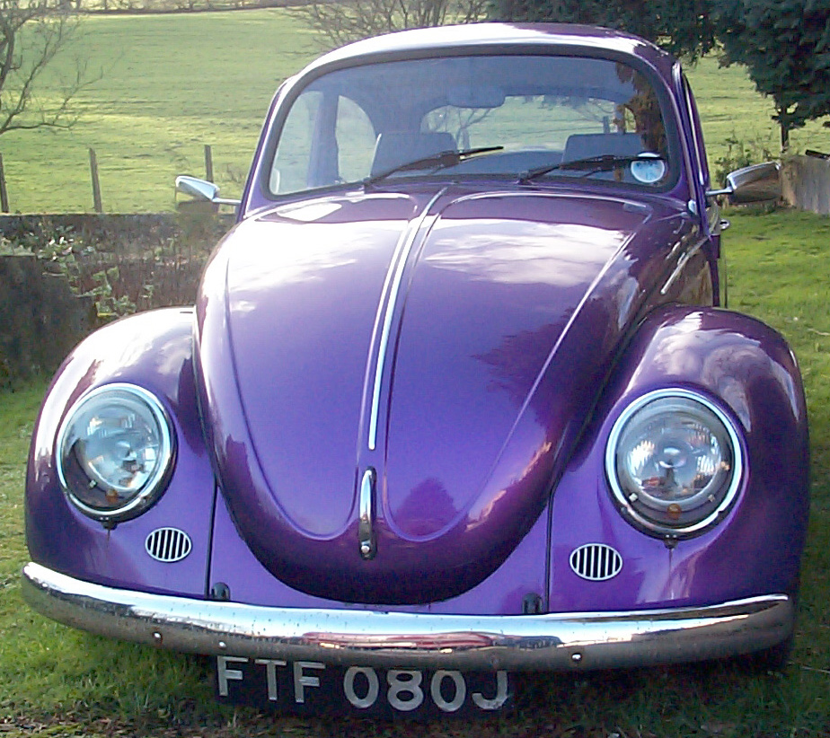
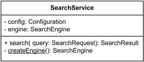
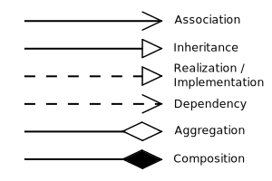
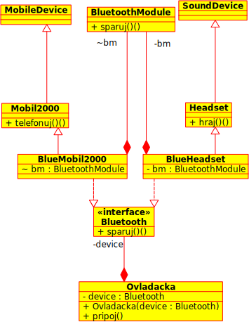

class: center,middle
# Abstraktné typy a rozhrania

Prednáška č. 5

Objektovo orientované programovanie

Ing. Daniel Hládek

---
# Obsah prednášky

Dedičnosť

- Abstraktné typy
- Rozhrania
- Dedičnosť
- Diagram tried

---
# Abstraktná trieda

Abstraktnú triedu vyznačujeme slovíčkom abstract.

https://stackoverflow.com/questions/1320745/abstract-class-in-java

Každá trieda je abstrakciou niečoho. Niekedy je dobré vyznačiť nadradenú triedy, 
ktorá je určená iba na dedenie ale nie aby sa podľa nej vytvárali inštancie.

Abstraktná trieda je určená iba na dedenie.

Z abstraktnej triedy nie je možné vytvoriť inštanciu.

---
# Toto nie je auto



---
# Príklad na abstraktnú triedu

Je možné si kúpiť v obhode Auto?

(možno v hračkárstve).

```java
abstract class Auto {
	public void startuj(){
    	System.out.println("Vrrr");
	}
    
    public static void funguj(){
    	Auto a = new Auto();
        // Nebudem fungovať, lebo sa ani nepreložím.
        a.startuj();
    }
}
```

---
# Abstraktná metóda

Nemá definované telo, je iba deklarovaná  svojím menom, argumentami a návratovým typom.

Nemôže byť final ani static

Abstraktná metóda je taká, ktoré nemá definované svoje telo.

Abstraktnú metódu vyznačujeme slovíčkom abstract.


```java
abstract class Auto {
	public abstract void soferuj();
}
```

---

# Dedenie z abstraktných tried

Z abstraktnej triedy nie je možné vytvoriť inštanciu, je určená iba na dedenie.

```java
abstract class Auto {
	public abstract void soferuj();
}

// Chyba - Osobne auto musi byť abstract, lebo neimplementuje soferuj()
class OsobneAuto extends Auto {
	private int pasazieri;
	public void nasadni() {
    	pasazieri += 1;
    }
    public static void funguj(){
    	Auto a = new Auto();
        // Nebudem fungovať, lebo sa ani nepreložím.
        a.soferuj();
    }
}
```

---
# Príklad na abstraktnú triedu

Každý potomok abstraktnej triedy musí byť abstraktný alebo implementovať abstraktnú metódu:

```java
abstract class Auto {
	public abstract void soferuj();
}
// Vieme, že sa nedá vytvoriť inštancia
abstract class OsobneAuto extends Auto {
	private int pasazieri;
	public void nasadni() {
    	pasazieri += 1;
    }
}
// Toto je v poriadku
class Favorit extends OsobneAuto {
	
    public void soferuj(){
    	System.out.println("Vrrrr");
    }
}
```

---
# Slovíčko final

Je možné použiť vo viacerých kontextoch:
- pri členským premenných zakazuje ďalšiu modifikáciu
- Pri metóde zakazuje prekrytie
- Pri triede zakazuje dedenie

(ale neodporúča sa to používať)

---
# Dedičnosť a volanie konštruktora

Pri dedičnosti musíme vždy zabezpečiť volanie nadradeného konštruktora (pomocou referencie _super_).
Volanie nadradeného konštruktora nemusí byť explicitné, ak má nadradená trieda defaultný konštruktor.

```java
class Robot {
	private int verzia;
	public Robot(int verzia){
    	this.verzia = verzia;
    }
}

class StaryRobot extends Robot {
	private int vek;
	public StaryRobot(int vek,int verzia){
    	super(verzia);
    	this.vek = vek;
    }
}

class MojStaryRobot extends StaryRobot {
	private String meno;
	public MojStaryRobot(String meno){
    	super(100,2);
    	this.meno = meno;
    }
}
```

---

# Rozhrania


Rozhranie je podobné triede, ale:

Obsahuje samé abstraktné metódy - metóda je abstraktná implicitne.

Môže obsahovať aj konštanty (public static final).

Rozhranie je dobré v prípade, že podobná funkčnosť sa nachádza vo viacerých typoch.

---
# Príklad na rozhranie

Rozhranie tvoríme pomocou slovíčka *interface*

```java
interface Breakable {
	void break();
}
```

Rozhranie je abstraktná trieda ktorá má samé abstraktné metódy.

Od rozhrania dedíme pomocou slovíčka *implements*

```java
class Glass implements Breakable {
	public void break(){
    	System.out.println("Buch Buch");
	}
}
```

---
# Rozhranie sa správa ako dátový typ

Rozhranie je skoro to isté ako abstraktná trieda:

```java
class Hammer {
	public void use(Breakable thing){
    	thing.break();
    }
    public static void start(){
    	Breakable glass = new Glass();
		Hammer h = new Hammer();
        hammer.use(glass);
    }
}

```

Všimnite si, že Glass je zároveň Breakable.

---

# Rozhranie môže dediť od iného rozhrania

```java
interface Bylynozravec {
	public void jedzByliny();
}

interface Vseravec extends Bylinozravec {
	public void jedzMaso();
}

class DivaSvina implements Vsezravec {
	public void jedzByliny(){
    	System.out.println("Chrum chrum");
    }
	public void jedzMaso(){
    	System.out.println("Kroch Kroch Mnam");
    }
}


```

---

# Môže mať trieda viacerých rodičov?

Počas dedenia musíme zabezpečiť vyvolanie konštruktora nadradenej triedy.

V jazyku C++ je možné dediť od viacerých rodičov naraz. 
Nadradená trieda môže mať viac konštruktorov - musíme povedať ktorý koštruktor budeme volať,


V Jave je povolená *iba jednoduchá dedičnosť*.

Rozhranie definuje verejné metódy (a verejné statické členy) bez toho, aby ich implementovalo. Nemá žiadne členské premenné
a nie je potrebné ho inicializovať. Predíde sa tým problémom s poradím volania konštruktorov.

Ak potrebujete v triede využiť viaceré komponenty, *použite kompozíciu*!

https://stackoverflow.com/questions/21824402/java-multiple-inheritance

---
# Príklad na dedenie a implementáciu rozhania

Chceme aby sa naše výrobky dali ovládať pomocou Bluetooth. Máme Bluetooth modul, ktorý cheme montovať do všetkého. 

Naše výrobky:

```java
class Mobil2000 extends MobileDevice {
	public void telefonuj(){
    	System.out.println("Halo halo");
    }
}

class Headset extends SoundDevice {
	public void hraj(){
    	System.out.println("La La La");
    }
}

class BlueToothModule {
	public void sparuj(){
    	System.out.println("Zadaj PIN");
    }
}

```

---
# Rozhranie a kompozícia

Definujeme si Bluetooth rozhranie

```java
class BlueTooth {
	public void sparuj();
}
```
Toto rozhranie potom implementujeme v každom výrobku pomocou kompozície a delegácie metód:

```java
class BlueMobil2000 extends Mobil2000 implements BlueTooth {
	BlueToothModule bm = new BlueToothModule();
	public void sparuj(){
    	bm.sparuj();
    }
}

class BlueHeadset extends Headset implements BlueTooth {
	BlueToothModule bm = new BlueToothModule();
	public void sparuj(){
    	bm.sparuj();
    }
}
```

---

# Rozhranie a kompozícia

Dosiahli sme:
- každé zariadenie má vďaka kompozícii dostupnú funkčnosť Bluetooth Moduli
- Všetky zariadenie, ktoré majú bluetooth modul tvoria samostatný typ.
- Každé zariadenie si môže Bluetooth inicializovať vlastným spôsobom.

```java
class Ovladacka {
	BlueTooth device;
    Ovladacka(BlueTooth device){
    	this.devide = device;
    }
    public void pripoj(){
        device.sparuj();
    }
}
```

---

# Vhodné mená rozhraní

Pozrite sa do štandardnej knižnice.
	
	Runable, Cloenable – Java dohoda
	ActionListener, ActionHandler
	
https://stackoverflow.com/questions/2814805/java-interfaces-implementation-naming-convention
https://docs.oracle.com/javase/8/docs/

---
# Hierarchia tried


Posledný príklad bol dosť zložitý - 
definovali sme veľa tired a veľa vzťahov medzi nimi.

Triedy vieme usporiadať do hierarchie - každá trieda môže mať práve jednu 
nadradenú triedu, niekoľko rozhraní a využívať niekoľko komponentov.

Potrebujeme nástroj pre zobrazenie vzťahov medzi triedami

http://futurist.se/gldt/wp-content/uploads/12.10/gldt1210.svg

---

# Diagram tried

Class diagram

https://www.lucidchart.com/pages/uml/class-diagram


Hierarchia tried tvorí graf - graf vieme zobraziť.

- Uzly - Triedy
- Hrany - Vzťahy medzi triedami

https://en.wikipedia.org/wiki/Class_diagram


Class diagram zobrazuje vzťahy medzi triedami v objektovom návrhu.

---
# Zobrazenie tried v diagrame tried


Obsah obdĺžníka je rozdelený na tri časti:

1. Názov triedy
1. Členské premenné
1. Členské metódy

## Viditeľnosť

Vyznačená pomocou + -

# Statické metódy alebo členy

Podčiarknuté

---

# Príklad zobrazenia triedy v diagrame tried




Podľa http://www.uml-diagrams.org/class.html

---
# Vzťahy medzi triedami




https://vaughnvernon.co/?page_id=31

- Dependency - trieda A importuje triedu B (trieda sa používa iba v rámci metódy).
- Association - trieda A je súčasťou rozhrania triedy B (argumentom metódy alebo návratovou hodnotou)
- Composition - trieda A obsahuje má ako členskú premennú referenciu na triedu B
- Aggregation - - trieda A obsahuje ako jediná členskú premennú referenciu na triedu B 
- Generalization - trieda A je potomkom triedy B
- Implelemtation - trieda A implementuje rozhranie B

---
# Kompozícia a agregácia

Pri obidvoch vzťahoch je trieda B členskou premennou A.

Kompozícia: Ak B zanikne spolu s A

Agregácia: Ak B priamo nezávisí na A


https://stackoverflow.com/questions/11881552/implementation-difference-between-aggregation-and-composition-in-java

---
# Kompozícia

(plný diamant)

Pri kompozícii nie je referencia na Engine dostupná pre ostatných.

Neexistuje možnosť, aby si referenciu niekto zapamätal a tak objekt zachránil pred záhubou.

```java
final class Car {

  private final Engine engine;

  Car(EngineSpecs specs) {
    engine = new Engine(specs);
  }

  void move() {
    engine.work();
  }
}
```

---
# Agregácia

(prázdny diamant)

Pri agregácii nie je zaistené, že ak zanikne Car, tak zanikne aj motor.

```java
final class Car {

  private Engine engine;

  void setEngine(Engine engine) {
    this.engine = engine;
  }

  void move() {
    if (engine != null)
      engine.work();
  }
}
```

---
# Príklad na diagram tried




---
# Nástroje pre kreslenie UML diagramov

- Umbrello
- ArgoUML

Pomocou násotoja UML si môžete "naklikať" kostru Vášho projektu podľa diagramu tried.

https://en.wikipedia.org/wiki/List_of_Unified_Modeling_Language_tools


---
## Bibligrafia

Readings

ECKEL, B.: Thinking in Java. 4th Edition, Prentice Hall, 2006

    Interfaces (pp. 219 - 242)

Readings

MEYER, B.: Object-Oriented Software Construction. 2nd Edition, Prentice Hall, 1997

    Chapter 24: Using Inheritance Well (pp. 809 - 870)

---

# Zhrnutie

Triedu môžeme určiť len na dedenie ak určíme že je abstraktná.

Metódu môžem určiť na prekrytie tak, že je abstraktná.

Rozhranie je typ, ktorý je ekvivalentný abstraktnej triede s abstraktnými metódami.

Rozhranie nám umožňuje "viacnásobnú" dedičnosť.

Triedy a rozhrania medzi sebou majú vzťhy, ktoré vieme zobraziť pomocou diagramu tried.

---

# Koniec

