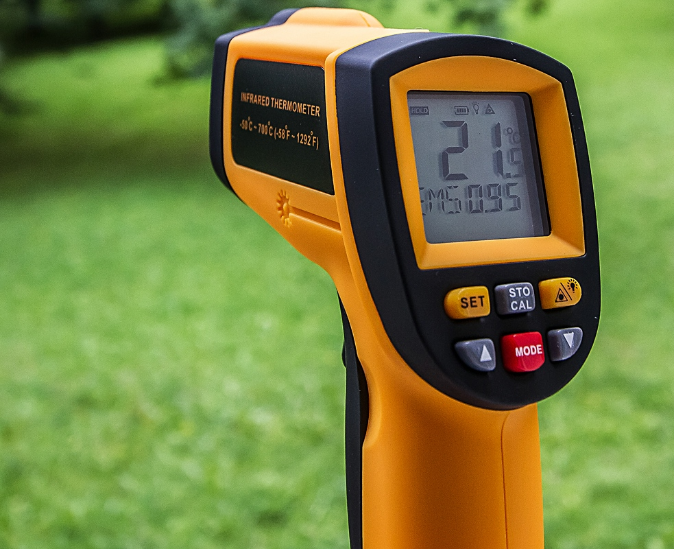
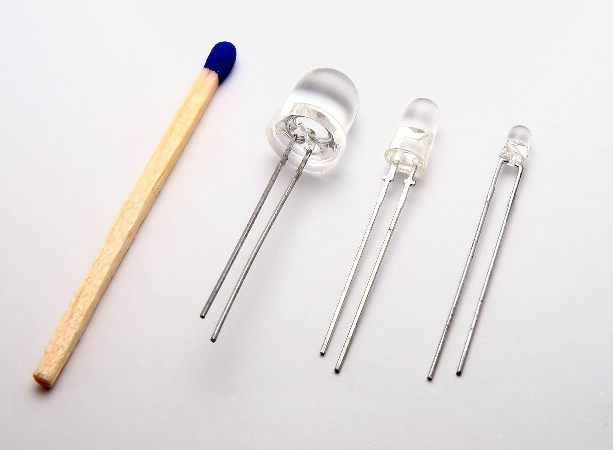
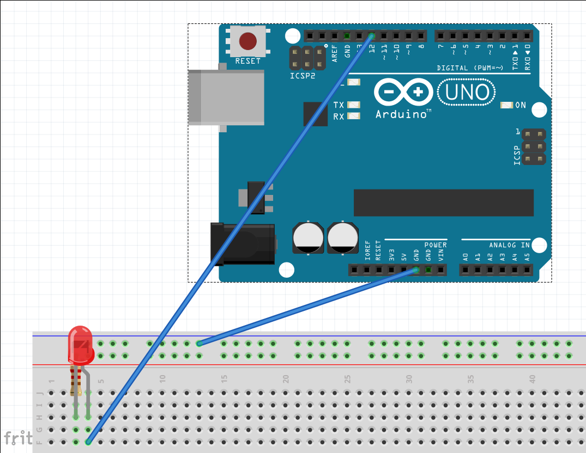

# Arduino

# Vložený systém

Jednoúčelový počítač, ktorý je súčasťou nejakého zariadenia.

<https://en.wikipedia.org/wiki/Embedded_system>

  - práčka

  - kalkulačka

  - hodinky

  - závora na parkovisku

  - teplomer

# Čo je mikrokontrolér



# Čo je mikrokontrolér

Malý počítač v jedinom čipe, riadi vložený systém.

  - Má svoju pamäť a procesor

  - Ale nič iné: — nemá OS — nemá periférie

<https://en.wikipedia.org/wiki/Microcontroller>

# Funkcia mikrokontroléra

  - Ćítanie zo vstupných zariadení

  - Modifikácia vnútorného stavu

  - Nastavenie výstupných zariadení

# Prečo mikrokontrolér?

  - Nízka spotreba a cena

  - Garantuje odpoveď systému v konečnom čase, rádovo v milisekundách

<https://en.wikipedia.org/wiki/Real-time_computing>

# Arduino

Sada na vytváranie prototypov

  - Mikrokontrolér

  - doska

  - sada pomocných obvodov

  - vstupno výstupné piny

  - nástroje na jednoduché programovanie Arduino IDE

# Arduino


# Z čoho sa skladá Arduino

  - napájací konektor

  - USB port

  - RX TX diódy

  - indikácia napájania

  - mikrokontrolér

  - piny

# Prvé kroky s Arduinom

Arduino IDE obsahuje všetko potrebné

Zapojíme napájanie, najjednoduchšie to je z USB (5V)

<div class="warning">

Nesprávne napájanie ho môže zničiť

</div>

# Programovanie Arduina - prostredie Wiring

Používame jazyk, ktorý sa podobá na C

``` c
void setup() {
    // Spustí sa raz
}

void loop() {
   // Opakuje sa dookola
}
```

# Kompilácia a spustenie programu

1.  Kompilátor na Vašom stroji preloži program.

2.  Program sa prenesie cez USB a nahrá sa do FLASH pamäte.

3.  Bootloader sa stará o spustenie programu.
    
      - Arduino nemá OS
    
      - Komunikácia prebieha cez sériový port (cez USB)

# Digitálne piny

  - na čítanie alebo na zápis

  - logická 0 alebo 1

  - pin sa správa podobne ako globálna premenná

# Práca s digitálnym pinom

1.  Nastavenie módu pinu
    
      - Čítanie alebo zápis
    
      - stačí iba raz

2.  Čítanie alebo zápis logickej hodnoty
    
      - zápis znamená nastavenie napätia na pine
    
      - čítanie znamená zistenie napätia na pine

# Zápis do digitálneho pinu

1.  Vyberieme si pin

2.  Nastavíme jeho mód na zápis

3.  Zapíšeme logickú hodnotu

4.  Na pine sa objaví alebo zmizne napätie 5 voltov

# Pozor na SKRAT

Dva krát meraj a raz rež.

Ak zapojíme pin priamo na zem \!\!\!

Malý odpor = veľký prúd = zničenie.

Na zabráneniu skratu používajte rezistory.

# Nastavenie pinu na zápis

    pinMode(LEDPIN, OUTPUT);

<div class="warning">

Nesprávne nastavenie pinu môže mať za následok zničenie.

</div>

# LED Dióda

Púšťa prúd iba jedným smerom.

Dlhšia nôžka ide na napätie.

<div class="warning">

Dióda sa zapája do série s rezistorom.

</div>

# LED Dióda



# Zapojenie LED Diódy

    +----------------+
    |                |
    |                | PIN 12
    |   Arduino      +------------+
    |                |            |
    |                |            |
    |                |           | |
    |                |      10k  | |
    +---------+------+           | |
              |  GND              |
              |                  ---
              |                  \ /
              |                   V
              |                  ===
              |                   |
              |                   |
              +-------------------+

# Zapojenie LED na digitálny pin



# Blikanie LED diódou

``` c
#define LEDPIN 12
void setup() {
  // Nastavenie módu OUTPUT pre pin LEDPIN
  pinMode(LEDPIN, OUTPUT);
}
void loop() {
  // Zápis hodnoty HIGH do pinu LEDPIN
  digitalWrite(LEDPIN, HIGH);
  // Čakanie
  delay(1000);
  // Zápis hodnoty LOW do pinu LEDPIN
  digitalWrite(LEDPIN, LOW);
  delay(1000);
}
```

# Zaujímavé vecičky majú tlačítka


# Čítanie z digitálneho pinu

<https://www.arduino.cc/en/Tutorial/Debounce>

Po stlačení tlačítka chceme zapnúť alebo vypnúť diódu.

# Nastavenie módu pinu na čítanie

Vysoký odpor = aj malý prúd stačí na jednotku = možnosť chyby

<div class="warning">

Pin na čítanie musí byť vždy zapojený na zem alebo na napätie

</div>

<https://learn.sparkfun.com/tutorials/pull-up-resistors>
<https://sites.google.com/site/arduinoslovakia/pod-kapotou-arduina/pull-up-a-pull-down-rezistory>

# Zapojenie prepínania

``` 
          +------------------------+
          |  +5V                   +
+---------+------+                  /
|                | PIN 3           +
|                +-----------------+
|   Arduino      | PIN 12          |
|                +------------+    |
|                |            |    |
|                |            |    |
|                |           | |  | |
|                |      10k  | |  | |  10k
+---------+------+           | |  | | PUL DOWN
          |  GND              |    |
          |                  ---   |
          |                  \ /   |
          |                   V    |
          |                  ===   |
          |                   |    |
          |                   |    |
          +-------------------+----+
```

# Naivné riešenia čítania z tlačítka

``` c
#define LEDPIN 12
#define BUTTONPIN 3
void setup() {
  pinMode(LEDPIN, OUTPUT);
  digitalWrite(LEDPIN, LOW);
  pinMode(BUTTONPIN, INPUT);
}
void loop() {
  int val = digitalRead(BUTTONPIN);
  if (val){
    digitalWrite(LEDPIN, HIGH);
  }
  else {
    digitalWrite(LEDPIN, LOW);
  }
}
```

# Riešenie z prepínaním

Musíme definovať stav - použiť globálnu premennú.

# Prepínanie LED so stavom (1)

``` c
#define LEDPIN 12
#define BUTTONPIN 3

int ledState;

void setup() {
  pinMode(LEDPIN, OUTPUT);
  digitalWrite(LEDPIN, LOW);
  pinMode(BUTTONPIN, INPUT);
  ledState = 0;
}
```

# Prepínanie LED so stavom (2|

``` c
void loop() {
  int val = digitalRead(BUTTONPIN);
  if (val){
    ledState = !ledState;
  }
  if (ledState){
    digitalWrite(LEDPIN, HIGH);
  }
  else {
    digitalWrite(LEDPIN, LOW);
  }
}
```

# Čítanie z digitálneho pinu

Problém: Stlačenie nie je dokonalé.

    5V |         **  **   *************
          |
          |
          |
          |
          |
       0V +-********--**--***---------------- t

Jedno stlačenie generuje viacero krátkych impulzov, ktoré je potrebné
odfiltrovať

# Lepšie riešnie načítania z tlačítka

<https://www.arduino.cc/en/Tutorial/Debounce>

Je potrebné si pamätať čas posledného stlačenia.

[Príklad na prepínanie LED pomocou tlačítka](debounce.c/highlight)

# Bibliografia

Simulátor Arduina UNO: <https://www.tinkercad.com/>

Fritzing

Arduino IDE

# Koniec
