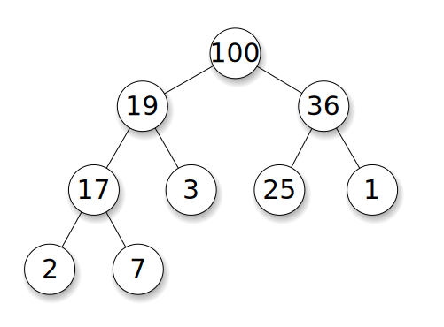

# Binárna kopa

---
## Prioritná fronta a binárna kopa

---
## Údajové štruktúry podľa poradia výberu

FIFO:: zásobník  - najprv sa odstraňuje najmladší prvok
LIFO:: frota - najprv sa odstraňuje najstarší prvok

---
## Prioritná fronta

Prvky majú pridelenú prioritu.

Najprv sa odstraňuje prvok s najväčšou prioritou.

---
## Sieťové aplikácie prioritnej fronty

- Máme zoznam paketov na smerovanie.
        - http
            - torrent
            - video
            - voip
- Každý paket má svoju prioritu.
- Chceme aby pakety VoIP mali prednosť.

---
## Ostatné aplikácie prioritnej fronty

- Grafové algoritmy:
    - optimálna cesta v grafe (A star)
    - minimálny strom v grafe ktorý spája všetky uzly
- Hufmannovo kódovanie

---
## Implementácia prioritnej fronty

- Vyhľadávací strom
- Kopa

---
## Kopa

Takmer *úplný* binárny strom ktorý je "kopovitý".

---
## Kopa



https://en.wikipedia.org/wiki/Heap_(data_structure)

---
## Výhody kopy

- O(n) pre vyhľadanie maximálneho prvku
- O(log(n)) pre vymazanie a pridanie
- O(n) pamäťové nároky

---
## Výhody kopy

- Nízka fragmentácia pamäte.
- Všetky údaje sú blízko seba.
- Nemusíme ukladať smerníky.

(Najmenší možný kúsok dynamickej pamäte je často 1 kB a viac).

---
## Takmer úplný strom vieme uložiť do poľa.

Počet uzlov s hĺbkou `n` je `n^2`, okrem poslednej úrovne.

---
## Takmer úplný strom vieme uložiť do poľa.


https://en.wikipedia.org/wiki/Heap_(data_structure)

---
## Vzťahy medzi uzlami v poli

```c
int parent(int i){
    return (i -1) / 2;
}
```

---
## Vzťahy medzi uzlami v poli

```c
int left_child(int i){
    return (2*i) + 1;
}

int right_child(int i){
    return (2*i) + 2;
}
```

---
## Kopovitosť

(Heap property)

Každý rodič je väčší alebo rovný ako všetci jeho potomkovia.

---
## Kopovitosť

[quote, Black  Paul E. (2004). Entry for heap in Dictionary of Algorithms and Data Structures. ]

> If P is a parent node of C, then the key (the value) of
> P is either greater than or equal to (in a max heap) or less than or equal to (in a min heap) the key of C.


---
## Kopenie

Všetky prvky musia spĺňať podmienku kopovitosti.

Usporiadanie poľa tak aby bolo kopovité.

https://www.geeksforgeeks.org/heap-sort/

---
## Kopenie podstromu

Predpokladáme, že ľavý a pravý podstrom  prvku `i` sú kopovité.

Výsledkom je, že strom s vrcholom `i` je kopa.

---
## Kopenie podstromu

- Vyberieme najväčší prvok z trojice rodič, ľavý a pravý syn.
- Ak je jeden z potomkov väčší ako rodič, vymeníme ich a a kopujeme ďalej.
- Zložitosť je `log(n)`.

---
## Kopenie podstromu

```c
void heapify(int* array,int size,int i){
    int largest = i;
    int l = left_child(i);
    int r = right_child(i);
    // Je ľavý syn väčší?
    if (l < size && array[largest] < array[l]){
        largest = l;
    }
    // Je pravý syn väčší
    if (r < size && array[largest] < array[r]){
        largest = r;
    }
    // Ak je niektorý syn väčší
    if (largest != i){
        // Vymeň ich a kopuj vymenený prvok.
        int v = array[i];
        array[i] = array[largest];
        array[largest] = v;
        heapify(array,size, largest);
    }
}
```

---
## Vytvorenie binárnej kopy

V druhej polovici poľa uzly nemajú potomkov.

Vieme, že v druhej polovici poľa sú určite kopovité prvky.

Kopíme všetky prvky zvyšné prvky smerom od konca ku začiatku.

---
## Vytvorenie binárnej kopy

```c
void heapify_array(int* array, int size){
    for (int i = size / 2; i > 0; i-- ){
        heapify(array,size,i);
    }
}
```

---
## Vytvorenie binárnej kopy

- Vytvorenie binárnej kopy má zložitosť `O(log(n))`
- Na začiatku je najväčší prvok.
- Všetky prvky poľa sú kopovité.

---
## Pridanie prvku do kopy

- Pridáme prvok na koniec kopy.
- Obnovíme kopovitosť všetkých jeho rodičov.

---
## Ubratie prvku z kopy

- Nahradíme prvý prvok posledným.
- Zmenšíme veľkosť kopy o jedna.
- Obnovíme kopovitosť koreňa.

---
## Heap sort

Postupne odoberáme prvky a najväčšie presúvame na koniec.

Zložitosť je `n log(n)`.

---
## Heap sort

```c
void heap_sort(int* heap,int size){
    for (int i = size -1; i >= 0; i -= 2){
        // Vymenime prvy a posledny prvok
        int v = heap[0];
        heap[0] = heap[i];
        heap[i] = v;
        // Na konci je najväčší prvok.
        heapify(heap,i,0);
    }
}
```

[note]
## Challenge

Prečo je v heap sorte `i = i - 2` ?
[/note]

---
## Demo binárna kopa

- https://www.cs.usfca.edu/~galles/JavascriptVisual/Heap.html
- https://www.cs.usfca.edu/~galles/visualization/HeapSort.html

---
## Zhrnutie

- Binárnu kopu môžeme použiť na triedenie alebo na vytvorenie prioritnej fronty.
- Binárna kopa je efektívna z hľadiska priestorovej aj výpočtovej zložitosti.

---
## Koniec


