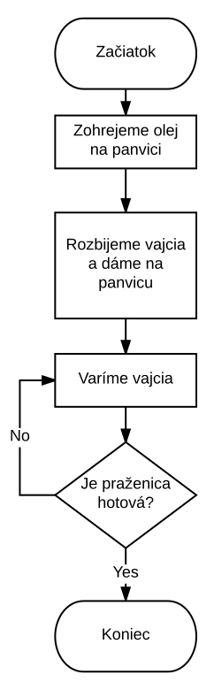

# 1. Úvod do programovania

## Organizačné pokyny a organizácia semestra

- Podmienky skúšky a zápočtu
- Odvzdávanie zadaní
- Získanie pomoci a konzultácie
- Politika plagiarizmu

## Obsah predmetu

- Základy UNIX
- práca s príkazovým riadkom
- Tvorba vývojových diagramov
- Vi , GIT
- Základy algoritmizácie pomocou knižnice Robot Karel
- Základy jazyka C
- štruktúrované programovanie
- dátové typy
- polia
- reťazce

## Čo je programovanie?

Séria slov ktorá pripomína ľudský jazyk. 

- Na čo je to dobré
	- Roboty
    - Spracovanie dát
    - Počítačové hry
    - Špeciálne efekty vo filmoch
    - Webové aplikácie - youtube, google, facebook
    - Mobilné aplikácie
    
Finančné benefity pre programátorov

Program je zápisom algoritmu

Algoritmus:

- Je jednoznačný - každý krok je presne definovaný.
- Je konečný - ukončí sa v dohľadnej dobe.
- Má vstup a výstup - presne definovaný
	- Ten istý algoritmus je použiteľný na iný vstup toho istého typu
- Je efektívny - nerobí zbytočné kroky

## Zápis algoritmov

- Prirodzený jazyk 
- Vývojový diagram
- Pseudokód
- Programovací jazyk

## Algoritmus varenia praženice

- Vstup: Vajcia, Olej
- Výstup: Praženica
- Podmienky: funkčný sporák a hrniec.
- Čas prípravy: cca 6 minút

Postup:

1. Nalejeme olej na panvicu a zohrejeme olej
1. Rozbijeme vajcia a vylejeme ich na panvicu
1. Miešame vajcia
1. Ak je praženica hotová, vypneme sporák. Ak nie, ďalej miešame vajcia.

## Vlastnosti receptu na praženicu

Ten istý recept vieme použiť aj na viaceré vajcia.

Uvarenie praženice trvá konečný čas. Praženica, ktorá sa nedá uvariť v konečom čase je zbytočná.

Recept neobsahuje kroky, ktoré nesúvisia s varením praženice. Fajčenie škodí zdraviu.

Podľa receptu vieme pripraviť optimálnu praženicu. Keby sme napríklad vymenili pridanie oleja a vajec, 
výsledná praženica by nebola najchutnejšia. 

## Vývojový diagram

- Diagram má vlastnosti algoritmu
	- začiatok a koniec
    - jednoznačne definovanú postupnosť krokov
    - vykonanie každého kroku trvá konečný čas
    - Vykonanie celého postupu trná konečný čas
    
## Dôležité kompoenty vývojového diagramu:

https://en.wikipedia.org/wiki/Flowchart

- Začiatok a koniec
	- Terminátor
- Proces
	- Krok ktorý sa výkoná
    - Proces je nejaký iný algoritmus
    - Priradenie alebo definícia premennej
- Vstup a výstup
	- načítanie alebo výstup premennej. Je to druh provesu
- Podmienka
	- Vetvenie v behu algoritmu na základe splnenia podmienky
    - Podmienku môžeme vyjadriť ako aritmetický výraz alebo slovne
- Slučka
	- Zovšeobecnená podmienka
    - Skladá sa z podmienky a tela
    - Slučka typu:
    	- while
        	- najprv vyhodnotí podmienku, potom vykoná telo
        - do 
        	- najprv vykoná telo, potom vyhodnocuje podmienku
        - for 
        	- iniucializačný výraz, ukončovacia podmienka, inkrementácia
          

## Pseudokód

https://en.wikipedia.org/wiki/Pseudocode

- Niečo medzi prirodzeným jazykom a programovacím jazykom
- Napodobňuje syntax niektorého programovacieho jazyka, ale nie je striktný.
- Najčastejšie býva založený na jazyku PASCAL, C alebo PYTHON

Pseudokód:

	Prazenica urob_prazenicu(vajcia,olej){
    	prazenica = ohrej(olej);
        prazenica += rozbi(vajcia);
        while(je_hotova(prazenica)){
        	ohrej(prazenica);
        }
    	
    	return prazenica;
	}

## Čo je to funkcia

Je to algoritmus

- Vstupné hodnoty
- návratové hodnoty
- algoritmus

## Zadanie

- Scratch

## Čo bude na ďalšej prednáške

- Vykonávanie algoritmov
- Úvod do Linuxu
- Práca s príkazovým riadkom
- Prineste si počítač

## Bibliografia

https://www.khanacademy.org/computing/computer-programming/programming/intro-to-programming/v/programming-intro
http://courses.cs.vt.edu/cs2104/Fall12/notes/T16_Algorithms.pdf

