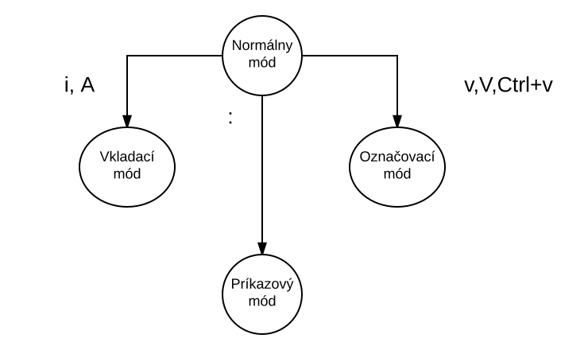

# Textový editor VIM

Pri vzdialenom prístupe na server si väčšinou nevystačíte s Vaším obľúbeným textovým editorom pracujúcim v grafickom móde (napr. Notepad).
Je výhodné naučiť sa terminálový editor aj keď s ním nebudete pravidelne pracovať.

Textový editor sa odlišuje od textového procesora (napr. LibreOffice alebo Word) tým, že pracuje priamo priamo s textom a neumožuje 
formátovacie operácie (napr. tučné písmo). Hlavné použitie textového editora nie sú kancelárske dokumenty, 
ale zdrojové texty programov alebo konfiguračné súbory.

Textový editor musí byť prispôsobený možnostiam terminálu:

- Pomalé prenosové rýchlosti
- Nízka odozva
- Nekompatibilné mapy klávesnice

Textový editor, podobne ako ostatné príkazy v Unixe nepracuje v grafickom móde ale iba v textovom.
Z toho dôvodu obsahuje iba obmedzenú podporu pre myš a neobsahuje klasické výberové menu.
Namiesto toho príkazy editoru zadávame výlučne pomocou klávesnice.

Existuje veľa rôznych textových editorov pre vhodných do terminálu.

- emacs
- vi
	- vim
    - neovim
- nano, pico
- joe
- sed (neinteraktívny editor)

## Módy editora VIM

Editor ViM je de-facto štandard pre editovanie textových súborov v prostredí terminálu. 

Na začiatku je práca s VIM ťažšia a menej intuitívna. Každá naučená operácia ale spôsobuje výrazne zvýšenie rýchlosti práce.
Vycvičený používateľ s ním dokáže pracovať oveľa rýchlejšie ako s klasickým editorom. Viaceré profesionálne editory 
obsahujú VIM mód, ktorý napodobňuje správanie editora VIM.

ViM je  modálny editor. V každom móde sú dostupné iné funkcie.

Normálny mód:
- Príkazy editoru zadávame stlačením kláves. Jedna klávesa je spravidla jeden príkaz, napor. príkazom p vložíme slovo zo schránky. 
- Návrat do normálneho módu je vždy pomnocou ESC.

Príkazový mód:
- V príkazovom móde píšeme dlhšie príkazy editoru do príkazového riadka. Môžeme prejsť na konkrétny riadok, 
	alebo môžeme vykonať príkaz SHELL.
    
Editovací mód:
- Editovací móid začneme príkazom i,I alebo a,A.
- V editovacom móde píšeme text.
- Snažíme sa byť v ňom čo najkratšie a čo najviac operácií s textom vybaviť v normálnom alebo príkazovom móde.

Označovací mód:
- Aktivujeme ho príkazom v.
- Šípkami označíme text.
- príkazom y skopírujeme text do schránky.
- Príkazom ESC skončíme označovací mód.



Z každého módu sa vždy viete ľahko prepnáť do normálneho módu pomocou ESC.
Ak ste zabudli v akom ste móde, prepnite sa do normálneho módu a zopakujte akciu.

## Príklad

Napíšeme svoj prvý román v editore ViM.

Najprv sa prihláste na Váš obľúbený UNIX server.
Príkazom vim spustíte editor. Zobrazí sa Vám uvítacia obrazovka. Prečítajte si ju, a príkazom :help otvorte vstavanú pomoc.
Príkazom ESC :q skončíte editor. Ak ste náhodou vložili nejaký text, musíte potvrdiť ukončenie bez uloženia pomocou výkričníka.

	<ESC>:q!

Hoci táto skupina znakov na prvý pohľad vyzerá zložito, má to svoje opodstatnenie.
Klávesu ESC nájdete ľahko, podobne aj : a q. Častým používaním určitých 
kláves sa naučíte prstoklad a budete písať podobne intuitívne ako hráči na klavíri.

Skončite editor a otvorne nový súbor:

```shell
vim tazkyzivot.txt
```

Editor sa spustí v normálnom móde.
Román začnete písať po stlačení i, ktorým editor prepnete do editovacieho módu.
Na začiatok napíšeme tento text:

	Ťažký život námorníka na suchej zemi
    
    Bola to ťažká noc. Ráno som nevedel rozlepiť oči.
    Rýchlo som vstal.

Editovanie ukončíte stlačením ESC. Po texte sa pohybujete šípkami, 
klávesami hjklwWbB. Zistite aký je medzi nimi rozdiel (môžete využiť príkat :help).

Nápoveda - profesionáli používaju w a b, nemusia pritom veľa rozmýšľať 
a hľadať kde stratili myš.

Po kontrole ste zistili, že veta číslo 3 (Rýchlo som vstal.) je príliš ľahká na taký ťažký román.
Príkazom :4 sa expresne presuniete na tretiu vetu na štvrtom riadku. Dajte pozor, aby ste boli v normálnom 
móde (presvedčiť sa o tom môžete pomocou klávesy ESC). Príkazom dd celý riadok vymažete.

Vymazaný riadok môžete vrátiť príkazom p (vloženie zo schránky) alebo u (undo). Príkaz . (bodka) vie zopakovať poslednú operáciu.
Ľahko potom viete celý román odľahčiť touto ľahkou vetou, tak aby text vyzeral:

	Ťažký život námorníka na suchej zemi
    
    Bola to ťažká noc. Ráno som nevedel rozlepiť oči.
    Rýchlo som vstal.
    Rýchlo som vstal.
    Rýchlo som vstal.

Ak chceme text spraviť menej dynamický, nahradte všetky výskyty Rýchlo na Pomaly. Prístup neznalého študenta by bol
prepnúť sa do vkladacieho módu, 
vymazať písmená pomocou delete a tri krát napísať to isté. Využijeme ale možnosti editora ViM na kreatívne písanie.

Ak ste v normálnom móde, napíšte:

	/Rý<ENTER>

Kurzor skočí na prvý výskyt "Rý" v súbore. Príkazom n a N sa môžeme pohybovať medzi nájdenými reťazcami. 
Príkazom Crtl+V sa prepneme do blokového označovacieho módu a označíme všetky slová Rýchlo.
Príkazom c (change) vymažeme všetko označené a prepneme sa do vkladacieho módu. Napíšeme "Pomaly" a ukončíme editovanie.
Vymazaný text máme v schránke a môžeme ho niekde vložiť pomocou p.

Výsledok by mal vyzerať:

	Ťažký život námorníka na suchej zemi
    
    Bola to ťažká noc. Ráno som nevedel rozlepiť oči.
    Pomaly som vstal.
    Pomaly som vstal.
    Pomaly som vstal.
    
    Rýchlo
    Rýchlo
    Rýchlo
 
 
Zbytočné riadky viete vymazať pomocou dd, zbytočné slová pomocou daw, zbytočné vety pomocou das.
Súbor uložíme pomocou w.

Uložiť a skončiť :wq alebo ZZ.

## Úloha

Čo najrýchlejšie nakreslite vo ViM textovú tabuľku s menným kalendárom pre aspoň jeden vybraný týždeň, kde uvediete:
- Meno
- Dátum
- Deň v týždni

Bunky oddeľte pomocou zvislej čiary ```|```, prvý riadok odddeľte pomocou ```=```.
Tabuľku začnite a skončite pomocou ```_ a -```.

Pomôcka:

Využite blokové editovanie, kopírovanie riadkov a opakovanie poslednej operácie. 

## ViM Ťahák

Zhrnutie práce s editorom ViM:

    :tutorial - Spustí interaktívny tutoriál
    :help spustí pomoc. ] a Ctrl+T funguje na hpertextové odkazy.
    :q! skončí editovanie a zahodí zmeny.
    Esc - Normálny mó
    i - vkladací mód
  	a - koniec riadka a vkladací mód
    v - vizuálny (označovací) mód
    V - riadkový vizuálny mód
    Ctrl-V - blokový označovací mód
    y - kopíruj (vo vizuálnom móde)
    x - vyber (vo vizuálnom móde)
    = - uprav odsadenie, uprac kód (vo vizuálnom móde)
    yy - kopíruj riadok
    dd - vymaž riadok
    dw - vymaž slovo
    das - vymaž aktuálnu vetu
    P - vlož
    ZZ - ulož a skonči
    / - vyhľadávanie
    * - vyhľadávanie aktuálneho slova alebo mena
    gg choď na začiatok
    G choď na koniec súboru
    :2 choď na riadok číslo 2
    :w - ulož
    u - undo
    Crtl-R - redo
    :make stairs - prelož program stairs
    :!./stairs.run - spusti program stairs
    
## Čo ďalej s editorom ViM:

- Zahrajte si ViM Hru
	https://vim-adventures.com/
- Skúste Online Vim Interaktívny tutoriál_
	http://www.openvim.com/
- Prejdite si interaktívny tutoriál príkazom :tutor
- Prečítajte si rozne iné tutoriály, napr.
	http://www.nti.tul.cz/~satrapa/docs/vim/
    http://www.abclinuxu.cz/clanky/navody/editor-vim-prakticky-i
    http://www.viemu.com/a_vi_vim_graphical_cheat_sheet_tutorial.html
- Nainštalujte si plugin, ktorý rozšíri možnosti ViMu.
	- pre prácu s GIT: https://github.com/tpope/vim-fugitive
- Vytvorte si vlastný konfiguračný súbor pre ViM, napr.
	https://github.com/hladek/vimrc