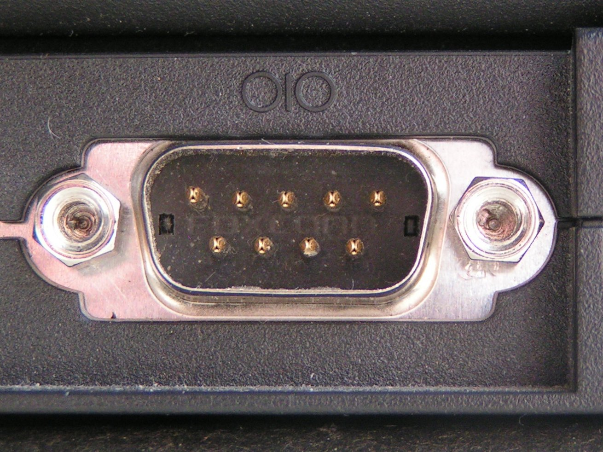

# Sériová komunikácia, práca s analógovým pinom

Implementácia domácej meteostanice s pripojením na PC.

# Príklady použitia Arduina

  - Teplomer

  - Fotorezistor

  - Tachometer

  - Výškomer

# Senzor je analógové zariadenie

Pokiaľ to nie je spínač.

# Je táto čiara spojitá ?

``` 
         __________
        /
       /
______/
```

# Analógovo digitálny prevodník

Ćím väčší odpor, tým väčšie napätie.

  - Ćítanie hodnoty z potenciometra

  - Ćítanie hodnoty z teplomera

# Analógovo digitálny prevodník

Prepis spojitej krivky na mriežku.

(Kreslenie na štvorčekový papier)

  - kvantizácia (vertikálne rozlíčenie)

  - samplovanie (horizontálne)

# Analógové piny

Každý pin obsahuje digitálno analógový prevodník:

Piny A0 až A5.

Prepis hodnoty napätia na celé číslo.

# Rozlíšenie prevodníka

kvantizácia na 10 bitov

|                      |                |
| -------------------- | -------------- |
| Hodnota (analogRead) | Napätie (Volt) |
| 0                    | 0              |
| 512                  | 2,5            |
| 1023                 | 5              |

# Vzorkovacia frekvencia:

Závisí na rýchlosti Arduina a na programe, max. cca 9600 Hz

# Zapojenie analógového pinu

``` 
          +----------------------+
          |  +5V                 |
+---------+------+               |
|                | PIN A0       | |
|                +------------->| | 10k
|   Arduino      |              | |
|                |               |
|                |               |
|                |               |
|                |               |
|                |               |
+---------+------+               |
          |  GND                 |
          |                      |
          |                      |
          +----------------------+
```

# Zapojenie analógového pinu

Veľký vnútorný odpor: stačí malý prúd na čítanie

Môže vzniknúť falošné čítanie ak sa piny zapoja blízko seba.

Medzi čítaniami je dobré urobiť pauzu.

# Napäťový delič

<https://en.wikipedia.org/wiki/Voltage_divider>

  - Umožňuje prispôsobiť hodnotu napätia

  - Vhodné na čítanie s potenciometra

# Ćítanie z analógového pinu

Nastavenie módu

    pinMode(A0,INPUT)

# Čítanie z analógového pinu

Získanie hodnoty

    int value = analogRead(A0);

Konverzia celočíselnej hodnoty do rozsahu (lineárna transformácia):

    int mvoltage = map(value, 0, 1023, 0, 5000);

## Číslo s plávajúcou desatinnou čiarkou

<https://www.arduino.cc/reference/en/language/variables/data-types/float/>

Na Arduine sa lepšie robia celočíselné operácie.

Dátový typ float je pomalší.

# Čo s načítanou hodnotou?

  - vykonať nejaký výpočet

  - uložiť

  - odoslať na iné zariadenie (pomocou sériovej komunikácie).

# Serial port DE9 pre RS232



# Sériová Komunikácia

<https://www.arduino.cc/reference/en/language/functions/communication/serial/>

<https://learn.sparkfun.com/tutorials/serial-communication/all>

  - Piny RX, TX (TTL - transistor,transistor logic)

  - USB Port

# Prečo sériová komunikácia

  - Piny a káble sú drahé

  - Veľa zariadení (napr. displej) komunikuje sériovo

# Sériová komunikácia

  - synchrónna: prenos, hodinový signál

  - asynchrónna: prenos, bez hodninového signálu.

# Módy prenosu

  - duplex (čítanie aj zápis naraz)

  - polovičný duplex (čítanie aj zápis, ale iba jedným smerom naraz)

  - simplex (komunikácia iba jedným smerom)

# Rámce dát v sériovej komunikácii

  - štart bit

  - data bity

  - stop bit

  - nepovinný bit kontroly parity

# Sériová komunikácia Arduino

obvod UART - universal asynchronous receiver-transmitter

  - Serial (UART)

  - SoftwareSerial

# Rýchlosť komunikácie

    void setup() {
        Serial.begin(9600);

``` 
    while (!Serial) {
        ; // waiting for serial port
    }
}
```

# Čítanie zo sériovej linky

Ćítame a zapisujeme celé čísla

    Serial.read()
       Serial.readString()

# Zápis na sériovú linku

    Serial.print()
       Serial.println()
       Serial.write()

# Monitor sériového portu

Rýchlosť zápisu a čítania musí byť rovnaká na oboch stranách

# Koniec
