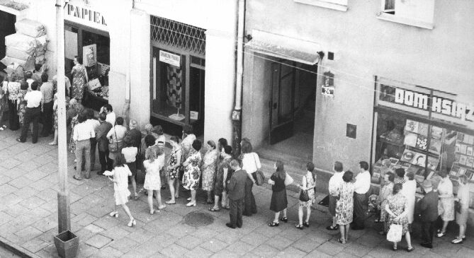

# Triedič

<div class="tip">

<div class="title">

Naučíte sa

</div>

  - Vytvoriť a triediť zoznam slov.

  - Pracovať s poľom smerníkov.

</div>

Vďaka Vašim dobrým ohlasom sme zaznamenali zvýšený záujem o študijný
program Počítačové siete. Naše študijné oddelenie je zavalené množstvom
prihlášok a nestíha preto pracovať na iných úlohách. Náš študijný
program je tak populárny, že niektorým študentom poslali prihlášku
viacerí príbuzní - babka, mamka aj tetka. Zoznam s menami študentov je
preto chaotický, dlhý a niektoré mená sa opakujú viac krát.



Ako vždy, ťažkú prácu musíte urobiť za niekoho iného a zistiť zoznam
prijatých študentov.

Najprv načítajte maximálny počet študentov, ktorých je možné prijať. Ak
bol zadaný neplatný počet študentov, vypíšte o tom chybovú správu a
skončite program.

    puts("Nespravny vstup");

Potom načítajte zoznam prihlášok, ukončený prázdnym riadkom alebo koncom
súboru. Na jednom riadku sa nachádza jedno meno. Mená sú na začiatku
usporiadané ľubovoľne a jedno meno sa môže vyskytovať viac krát. Ak sa
nepodarí načítať žiadne meno, vypíšte chybovú správu a ukončite program.

    puts("Ziadne prihlasky");

Zabezpečte, aby sa žiadne meno v zozname študentov neopakovalo. Zoznam
zotrieďte podľa abecedy.

Potom vypíšte zoznam študentov, ktorí boli prijatí na štúdium.

    puts("Prijati studenti:");

Ak nie je možné prijať všetkých študentov, vypíšte aj zoznam neprijatých
študentov.

    puts("Neprijati studenti:");

# Preštudujte si

  - Algoritmus vyhľadávania v poli.

  - Smerník na smerník.

  - Triedenie s pomocou funkcie
    [qsort()](http://www.cplusplus.com/reference/cstdlib/qsort).

  - Funkcia [fgets()](http://www.cplusplus.com/reference/cstdio/fgets/)
    na načítanie riadku.

  - Funkcia
    [memset()](http://www.cplusplus.com/reference/cstring/memset/) na
    inicializáciu pamäte.

  - Dynamická alokácia pamäte pomocou
    [malloc()](http://www.cplusplus.com/reference/cstdlib/malloc/) a
    [free()](http://www.cplusplus.com/reference/cstdlib/free).

  - Funkcia [strlen](http://www.cplusplus.com/reference/cstring/strlen)
    na zistenie počtu znakov v reťazci.

  - Funkcia [strcmp](http://www.cplusplus.com/reference/cstring/strcmp)
    na porovnanie dvoch reťazcov.

# Analýza riešenia

Na uloženie zoznamu slov môžete využiť pole smerníkov do ktorého si
budete ukladať začiatky polí s menami.

Na začiatku si vytvorte pole smerníkov typu `char*` a inicializujte ho
na nulu (napr. pomocou `memset`). Potom môžte postupne načítavať mená -
jedno meno je na jednom riadku. Zapamätajte si počet slov uložených v
poli smerníkov.

Na načítanie použite funkciu `fgets`. Nezabudnite overiť úspešnosť
načítania pomocou návratovej hodnoty funkcie `fgets` a počet
načítaných znakov pomocou `strlen`.

INFO: Funkcia `fgets` načíta aj koniec riadka `\n` a všetky medzery.

Keď úspešne načítate meno, overte si či je také meno už prítomné v poli
smerníkov. Prejdite všetky hodnoty v poli smerníkov, jedna hodnota je
jeden začiatok reťazca. Načítaný reťazec a reťazec v poli smerníkov
môžte porovnať pomocou funkcie `memcmp`.

Vyhľadávanie v poli smerníkov môže vyzerať napr. takto:

``` c
for (int i = 0; i < pocet_slov_v_poli; i++){
    if (memcmp(pole_smernikov[i],line,pocet_znakov)){
        // Nasiel som
    }
}
```

Ak sa reťazec v poli smerníkov nenachádza, môžeme jeho kópiu pridať do
poľa smerníkov. Vytvorte si nové pole, dostatočne veľké na uloženie
nového reťazca a jeho začiatok si poznačte do poľa smerníkov.
Nezabudnite na miesto pre poslednú nulu.

``` c
pole_smernikov[pocet_slov_v_poli] = malloc(pocet_znakov + 1);
memcpy(pole_smernikov[pocet_slov_v_poli],line,pocet_znakov + 1);
pocet_slov_poli += 1;
```

Keď bude načítanie mena neúspešné alebo nenačítate žiadne znaky, môžte
načítanie ukončiť. Potom môžte zotriediť slová, uložené v poli
smerníkov, napr. pomocou funkcie `qsort`. Jedinou "ťažkou" časťou
triedenia je zostavenie porovnávacej funkcie.

``` c
int compare(const voit* arg1, const void* arg2){
    return 0;
}
```

Hodnota v triedenom poli je typu `char*` (adresa reťazca). V
porovnávacej funkcii preto premeníme všeobecnú adresu na adresu
hodnoty, teda adresu adresy reťazca ( `char` ). Z typu `char</emphasis>`
vieme potom ľahko získať hodnotu, teda začiatok reťazca na porovnanie.

Celá premena typov môže vyzerať nejako takto:

``` c
char* s1 = *((char**)arg1);
```

V premennej `s1` potom dostaneme reťazec a argumentu porovnávacej
funkcie `arg1` typu `const void*`

Na porovnanie dvoch reťazcov môžeme použiť funkciu `strcmp`.

Keď skončí Váš program nezabudnite uvoľniť pamäť, ktorú ste si vyhradili
(každý `malloc` musí mať kamaráta `free`):

``` c
for (int i = 0; i < pocet_slov_v_poli; i++){
    free(pole_smernikov[i]);
}
```

## Nezabudnite

  - Inicializovať pamäť hneď po vyhradení.

  - Uvoľniť pamäť po použití.

  - Uvoľniť pamäť pred koncom programu.

  - Vytvoriť si funkciu na často (viac ako 2) používané časti kódu.

  - Používať Valgrind.

  - Reťazec sa vždy musí končiť nulou.

# Odovzdávanie

Domácu úlohu (za 3b) vypracujte do súboru `program.c` do git repozitára
`pvjc19cv7`. Heslo na vypracovanie je `triedic`.
