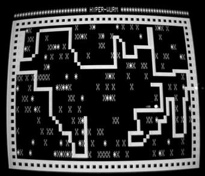

# Pán hadov

Vytvorte implementáciu klasickej hry
[Snakes](https://en.wikipedia.org/wiki/Snake_videogame), ktorú poznáte
zo starých mobilných telefónov.



V hre sa má had pohybovať po hracej ploche a jesť
náhodne rozmiestnené odmeny.

Had je tvorený viacerými článkami nasledujúcimi za sebou.
Pohyb prebieha tak, že vo zvolenom smere pribudne 
nový článok a odbudne posledný článok.
V prípade, že had práve zjedol odmenu, tak vymazanie 
posledného článku vynecháme a had je o jedno políčko dlhší.

Ak sa nová pozícia hada nachádza na hadovi alebo mimo hracej plohy 
tak sa hra končí.

## Príprava

Stiahnite si [kostru zadania](https://git.kemt.fei.tuke.sk/dano/snake/archive/master.zip) 
a oboznámte sa so zdrojovými kódmi.
Rozbaľte archív do priečinka `du7` do Vašom pracovnom adresári:

```
curl https://git.kemt.fei.tuke.sk/dano/snake/archive/master.zip > snake.zip
unzip snake.zip
mv snake ~/pvjc21/du7
cd ~/pvjc21/du7
ls -l
```

Projekt sa skladá z viacerých súborov, ich stručný opis
nájdete v súbore `README.md`.

Vašou úlohou bude modifikovať súbor `snake.c` tak aby boli
splnené automatické testy a aby ste sa vedeli zahrať hru na
Vašom počítači. Nájdete tam niekoľko funkcií, ktoré máte doprogramovať
podľa pokynov v súbore `snake.h`.

Najprv vytvorte spojkový zoznam (funkcie `add_snake`, `remove_snake`, `free_snake` a `is_snake`).
`
Keď budete mať spojový zoznam, bude jednoduché implementovať
celú hru vo funkcii `step_state`.

## Spojkový zoznam


Pre reprezentáciu hada je najprirodzenejšie použiť spojkový zoznam. 

Had je tvorený viacerými za sebou idúcimi článkami 
typu `struct snake`, kde každý článok má svoju pozíciu 
`x,y`. 
Pohyb hada sa dá implementovať
pridaním nového prvého článku  a zmazaním
posledného článku.

Budeme potrebovať tieto operácie:

- Pridanie nového prvku na začiatok (funkcia `add_snake`).
- Odobratie prvku z konca spojkového zoznamu(funkcia `remove_snake`).
- Zistenie, či prvok patrí spojkovému zoznamu (funkcia `is_snake`).
- Uvoľnenie spojkového zoznamu (funkcia `free_snake`).

Definíciu štruktúry hada a predpisy pre funkcie
pre prácu so spojkovým zoznamom nájdete v súbore `snake.h`.

### Pridanie nového prvku na začiatok

Funkcia by mala dynamicky alokovať pamäť pre novú štruktúru typu `struct snake`.
Funkcia calloc automaticky nastaví všetky členy štruktúry 
na nulu. Pomocu operátora šípka nastavte premenné `x` a `y`.

```c
struct snake* head = calloc(1,sizeof(struct snake));
head->x = x;
head->y = y;
```
Pridanie nového prvku na začiatok znamená pripojiť
na koniec nového prvku starý spojkový zoznam.

```
head->next = snake;
```

### Prechádzanie prvkov hada

Pre zistenie, či je zadaná súradnica súčasťou hada alebo nie musíme prejsť všetky prvky hada.

Na prechádzanie prvkov použijeme pomocný smerník `this` ktorý bude ukazovať
na aktuálny prvok hada.

Je jasné, že prechádzanie má zmysel iba v prípade, že spojkový
zoznam má aspoň jeden člen.

```c
struct snake* this = head;
```

Pomocný smerník môžeme posúvať podľa potreby na ďalší prvok:

```
this = this->next;
```

V prípade, že je smerník `this` nulový tak program spadne.
tomu by sme mali zabrániť vhodnou ukončovacou podmienkou.

Napr. ak chceme vyhľadať posledný prvok:

```c
while (this->next != NULL){
    this = this->next;
}
```
Keď cyklus zbehne, tak smerník `this` bude ukazovať na posledný prvok.

Alebo keď chceme prejsť všetky prvky:

```c
this = head;
while (this != NULL){
    // Niečo môžme s prvkom this spraviť
    this= this->next;
}
```

To isté sa dá dokázať aj pomocou cyklu typu `for`:

```c
for (struct snake* this = head; this != NULL; this=this->next){
    // Niečo môžme s prvkom this spraviť
}
```

### Zrušenie spojkového zoznamu

Každá dynamická alokácia pomocu `malloc` alebo `calloc` musí byť vo vhodnej chvíli zrušená pomocou 
volania funkcie `free`.

Ak už spojkový zoznam nebudeme potrebovať, tak je potrebné ho zrušiť.

Môžeme to urobiť iteratívne pomocou cyklu, ktorý prejde a zruší všetky prvku.
Musíme ale dávať pozor aby sme si "nepodpíli konár" a nezrušili
aj smerníkovú premennú `next`.

```
struct snake* next = this->next;
free(this);
// this->next je teraz neplatné
this = next;
```

Dá sa to spraviť aj rekurzívne:

1. Ak je zoznam prázdny, neurob nič.
2. Uvoľni koniec hada. (rekurzívne volanie so smenrníkom next).
2. Uvoľni aktuálny prvok hada.

### Odobranie posledného prvku

Funkcia pre odobranie posledného prvku musí spĺňať tieto podmienky:

- Uvoľniť pamäť posledného prvku
- Ak má had predposledný prvok, je potrebné jeho smerník `next` nastaviť na `NULL`.
- Musí vrátiť smerník na prvý prvok. 
- Ak už žiadny prvok nezostal, musí vrátiť `NULL`.

Pozor - posledný prvok spojkového zoznamu musí mať vždy 
smerník `next` nastaveny na `NULL`.

Funkcia na odstránenie posledného prvku sa dá implementovať
rekurzívne podľa týchto pravidiel.

`head` je smerník na prvý prvok hada.

1. Ak je `head` `NULL`, vráť `NULL`.
2. Ak je `head` posledný prvok, uvoľni `head` a vráť `NULL`.
3. Inak odstráň posledný prvok z ďalšieho prvku a vráť `head`.

Alebo odstránenie posledného prvku sa dá implementovať iteratívne:

1. Ak je `head` `NULL`, vráť `NULL`.
2. Ak je `head` posledný prvok, uvoľni `head` a vráť `NULL`.
3. Nájdi posledný prvok  hada, ale pamätaj si predposledný prvok.
4. Uvoľni posledný prvok a označ predposledný prvok hada ako posledný
5. Vráť `head`.

## Tvorba hry

Svet je viditeľná oblasť obrazovky. Po svete je náhodne rozhádzaných 20
odmien, vykreslených ako `*`. Svet nemá žiadne prekážky a je ohraničený okrajom obrazovky.
Telo hada je tvorené značkou `x`. Na začiatku je telo
hada dlhé 5 `x` a je umiestnený v strede obrazovky.

    [0,0]                              [width,0]
    +------> x
    |
    |       *                 *
    |
    v           ^
                x
    y           x
                x
                x
    [0,height]                         [width,height]

## Pohyb hada

Had sa pohne každé kolo podľa vektora rýchlosti uloženého v
    premenných `sx, sy`.
Vektor rýchlosti hada sa zmení podľa stlačených šípiek.
Ak nebola stlačená žiadna klávesa, vektor rýchlosti sa nemení.

``` 
                  KEY_UP [0,-1]
                        ^
                        |
    KEY_LEFT [-1,0] <---+---> KEY_RIGHT [1,0]
                        |
                        v
                 KEY_DOWN [0,1]
```

(`y` pre
vertikálny smer je negatívny, lebo bod `[0,0]` je v ľavom hornom
rohu obrazovky).

Nová pozícia sa vypočíta z aktuálnej pozície plus vektor rýchlosti.
Ďalšia hra je ovplyvnená budúcou polohou hada:

  - Ak je nová pozícia na tele hada, hra sa končí.
  - Ak je nová pozícia na odmene, had sa zväčší o jedna. Odmenu označte ako zjedenú tým, že jej nastavíte negatívne súradnice. Ak sú všetky odmeny zjedené, hra sa končí.
  - Ak je nová pozícia hlavy mimo rozmerov sveta, hra sa končí.
  - Ak sa na novej pozícii hlavy nenachádza odmena, vymaže sa posledný článok hada a pridá sa nový článok na novej pozícii.

### Reprezentácia odmeny

Pre reprezentáciu viacerých odmien sa používajú dva polia celých
čísel (`foodx,foody`) (jedno pre x-ové súradnice, druhé pre y-ové
súradnice).
Ak je odmena zjedená, bude sa nachádzať na mieste mimo hracej plochy
(`i`-ta hodnota v poliach `foodx` a `foody` bude záporná).

## Odovzdanie

Do súboru [du7/snake.c](https://traktor.kemt.fei.tuke.sk/#submit/154) za 10 bodov.

Na zisk plného počtu bodov musia prejsť automatické testy a  je nutné prezentovať funkčnú hru Vášmu cvičiacemu.

