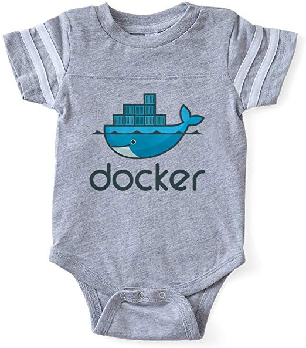

# Cloud computing

Prenájom výpočtových prostriedkov od poskytovateľa.

---
### Na čo je to dobré?

Aplikačné kontajnery a cloud computing znižujú náklady

---
### Celkové náklady na vlastnenie infraštruktúry

- cena servra
- cena serverovne
- plat administrátora
- plat developera
- náklady na energie
- náklady na údržbu

---
## Čo je lepšie?

- vlastná serverovňa: Private Cloud (On premise)
- Google/Microsoft/Amazon dátové centrum: Public Cloud
- časť doma, časť inde: Hybrid Cloud

---
## Public Cloud

- Časť zodpovedností sa deleguje na špecializovanú firmu
- servery vo veľkom

---
## Private Cloud

Viac vlastných servrov manažujeme ako jeden systém.

Vytvorí sa "pool vlastných zdrojov"

- sieť
- storage
- CPU
- GPU

---
# Aplikačný kontajner

Jedna aplikácia upravená tak aby mohla byť spustená v klaude.

---
## Aplikačný kontajner

Vrstva hostiteľského operačného systému ktorá vytvára "klietku" v ktorej beží jeden alebo viac procesov.

Aplikácia kontajneri využíva iba jadro Host OS.

- všetko ostatné je virtualizované
- Virtualizácia na úrovni operačného systému.

---
## Obraz kontajnera

- Súborový systém s aplikáciou, knižnicami aj OS
- časť "inštalačného balíčka" pre cloud s práve jednou aplikáciou

---
## Obraz

----
## Prenositeľnosť

Manažment závislostí aplikácie

Rovnaká alebo takmer rovnaká aplikácia beží v rôznych podmienkach.

- Ak vymením HW, nemusím vymeniť SW
- Ak vymením OS, nemusím vymeniť SW

Zabezpečenie prenositeľnosťi zvyšuje náklady na vývoj a údržbu produktu.

Prenositeľnosť zákazníci vyžadujú.

---
## Kontajner

---
## Kontajner

Bežiaca aplikácia

---
## Virtuálna sieť

Kontajner vidí "svoju" sieť.

---
## Virtuálny súborový systém

- Kontajner vidí svoj vlastný súborový systém
- Niektoré časti súborového systému nie sú trvalé

---
## Oddelenie dát od aplikácie

- Aplikácia nemá svoj stav
- Dáta môžu byť uložené [kdekoľvek](https://docs.docker.com/engine/extend/legacy_plugins/#finding-a-plugin)

---
## Docker

---
## Docker 

Virtualizačná vrstva medzi aplikáciou a operačným systémom

Aplikácia využíva jadro hostiteľského OS

- Docker podporuje "software defined networking".

---
## Docker

Umožňuje rýchlo spúšťať aplikáciu na ľubovoľnom uzle
bez toho aby ste museli riešiť inštaláciu a závislosti.

---
## Docker Komponenty

- docker client
- docker démon
- image registry

---
## Docker Komponenty

      +----------+
      | registry |   Docker Hub
      +----------+
           ||         (image)
      +----------+
      |   démon  |   Host machine
      +----------+
           ||         (protocol)
      +------------+
      | cli client |   Host machine
      +------------+

---
# Docker client

Príkaz 'docker' v príkazovom riadku

- beží na ľubovoľnom OS
- pomocou vlastného protokolu komunikuje s docker démonom

---
# Docker démon

- (väčšinou) beží na Linux OS alebo na Docker Machine
- stará sa o bežiace kontajnery

---
## Spustenie Docker kontajnera

    docker run nginx

na pozadí

---
## Interaktívne spustenie

    docker run -it --rm nginx

s konzolou

---
## Spustenie s mapovaním siete a zväzkov

    docker run  -p 80:80 -v /var/www:/var/www nginx

Mapovanie medzi reálnym a virtuálnym adresárom.

---
## Vytvorenie obrazu

Ako upraviť aplikáciu aby bežala na cloude?

- Oddelenie aplikácie, dát, siete a konfigurácie.
- Zapíšeme postup pre inštaláciu

---
## Analýza závislosti aplikácie

Každá aplikácia má svoje závislosti na nižších vrstvách:
- na knižnici
- na OS
- na procesore

Zmena HW, LIB alebo OS si vyžaduje zmenu aplikácie

---
# Príklad Dockerfile

Dockerfile sú inštrukcie ako zostaviť obraz

---

    FROM dockerfile/ubuntu
    RUN \
    add-apt-repository -y ppa:nginx/stable && \
    apt-get update && \
    apt-get install -y nginx && \
    rm -rf /var/lib/apt/lists/* && \
    echo "\ndaemon off;" >> /etc/nginx/nginx.conf && \
    chown -R www-data:www-data /var/lib/nginx
    WORKDIR /etc/nginx
    CMD ["nginx"] # Define default command.

[zdroj](https://github.com/dockerfile/nginx/blob/master/Dockerfile)

---
## Zdieľanie obrazu

Centrálny repozitár  Dockerhub

---
## Možné problémy pri vytváraní obrazu

- Závislosť na Docker Hub
- Časté využívanie neoverených obrazov
- docker démon beží ako 'root'

---
## Záver - Docker...

- je virtualizačná vrstva medzi jadrom a aplikáciou
- umožňuje ľahko spustiť aplikáciu v cloude
- zjednodušuje inštaláciu
