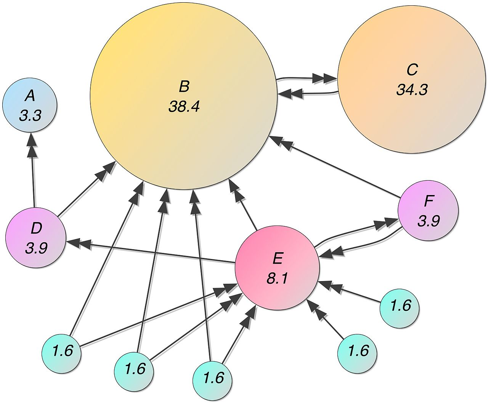
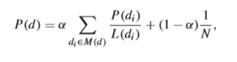
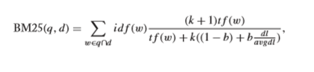

Tímový projekt 2019

# Poznámky z knihy Learning to Rank for Information Retrieval and Natural Language Processing 

Autor, Hang Li , v knihe  ukazuje rôzne problémy s hodnotením pri získavaní informácií a spracovaní v prirodzenom jazyku. Autor podáva podrobné vysvetlenia o učení sa pri tvorbe rebríčka a agregácií rebríčka, vrátane školení a testovania, hodnotenia, tvorby prvkov a hlavných prístupov. Na vytvorenie rebríčka bolo navrhnutých veľa metód. 

## Získavanie informácií 
Získavanie informácií (ang. Information retrieval, skratka IR) je veda o vyhľadávaní relevantných údajov v dokumentoch alebo samotnom vyhľadávaní dokumentov. Môžeme to chápať aj ako plne automatický proces, ktorý reaguje na požiadavku užívateľa preskúmaním dokumentov a vrátením zoznamu zoradených dokumentov, ktorý by mal byť relevantný voči požiadavke užívateľa. Takýto automatizovaný systém na získavanie informácií sa používa na zníženie preťaženia informáciami. Typickými systémami na takéto získavanie informácií sú webové prehliadače. Každé vyhľadávanie musí začať analýzou požiadavky, ktorú do systému zadal užívateľ.  

## Machine learning 
Strojové učenie je vedecká štúdia z algoritmov a štatistických modelov, ktoré počítačové systémy používajú na vykonanie určitej úlohy bez použitia jasného návodu.  Je to vnímané taktiež ako podskupina umelej inteligencie.  Algoritmy strojového učenia vytvárajú matematický model založený na vzorkách údajov, známych ako „školiace údaje“, aby mohli vykonať predpovede alebo rozhodnutia bez toho aby boli výslovne naprogramované na vykonanie úlohy. 

## Learning to rank 
Existuje mnoho otázok v oblasti získavania informácií a spracovania prirodzeného jazyka (ang. natural language processing), medzi ktoré patrí aj hodnotenie (ranking). Naučiť sa hodnotiť je užitočné pre mnoho aplikácií v oblasti získavania informácií, spracovania prirodzeného jazyka a získavania 
údajov. Pri  získavaní informácií je veľmi dôležité určiť, resp. ohodnotiť správnosť vyhľadaných informácií. Je potrebné určiť či sú tieto informácie pre nás relevantné alebo nie.  Učenie  správne hodnotiť je založené na hodnotení pomocou strojového učenia.  

## Natural language processing 
Spracovanie prirodzeného jazyka (NLP) je odvetvie umelej inteligencie, ktoré pomáha počítačom porozumieť, interpretovať a manipulovať s ľudským jazykom. NLP čerpá z mnohých disciplín, vrátane počítačovej vedy a výpočtovej lingvistiky, v snahe zaplniť medzeru medzi ľudskou komunikáciou a počítačovým porozumením. 
 
## Ranking creation 
Autor v knihe opisuje problémy s vytváraním hodnotenia, ktoré je možné rozdeliť na dve základné úlohy : 
- Tvorba hodnotenia (ranking) - Ranking aggregation 
Môžeme predpokladať, že pri vytváraní hodnotenia máme 2  množiny :  
Q = {q1, q2, ···, qi, ···, qm} 
O = {o1, o2, ···, oj, ···, on} 
Množina Q môže obsahovať otázky pri vyhľadávaní dokumentov. Množina O môže byť množina, ktorá obsahuje cieľové vety, resp. odpovede na naše otázky. Obe množiny môžu byť nekonečné.   Hodnotenie sa vytvára pomocou tzv. funkcie bodovania. 
 
## Ranking aggregation 
Agregácia klasifikácie môže byť pod dohľadom alebo bez dozoru.  Agregácia klasifikácie je vlastne proces kombinovania viacerých zoznamov rebríčkov do jediného rebríčka, ktorý je určený pre väčšinu ostatných vedúcich zoznamov. 
 
## PageRank 
PageRank je algoritmus, ktorý pridelí čísla s ohodnotením každému prvku v množine, ktoré sú navzájom prepojené, napr. World Wide Web. Čísla prideľuje s cieľom  ohodnotiť významnosť daného prvku (dokumentu) v množine. Tento algoritmus je pomenovaný podľa svojho zakladateľa – Larry Page. Tento algoritmus používa aj Google na určenie popularity . Pre tvorcov webových stránok to znamená toľko, že čím väčší je náš PageRank, tým väčšiu dôležitosť stránke prideľuje Google a iné vyhľadávače. A čím je dôležitosť väčšia, tým vyššie je umiestnenie medzi výsledkami vyhľadávania. Samozrejme to nie je jediné kritérium, ktoré stránky posúva medzi výsledkami vyššie. Druhou výhodou je, že vyhľadávač prehľadáva najviac stránky, ktoré majú najväčší PageRank. Google aktualizuje PageRank cca v 3-mesačnom intervale. 
PageRank funguje spočítaním počtu a kvality odkazov na stránku, aby určil hrubý odhad dôležitosti webovej stránky. Základný predpoklad je, že dôležitejšie webové stránky pravdepodobne získajú viac odkazov z iných webových stránok. 

PageRank vyjadruje hodnotenie v percentách. Algoritmus Googlu používa logaritmické vyjadrenie. Na obrázku môžeme vidieť, že stránka s označením C má vyšší PageRank ako stránka E, aj keď je na stránku E viacero odkazov. PageRank  vypočítame podľa tohto vzorca : 

Kde P(d) je pravdepodobnosť zobrazenia stránky d, P(di) je pravdepodobnosť zobrazenia stránky di a M(d) je množina stránok pripojená k d, L(di) je počet odkazov grafu, α je váha. 

## Okapi BM25 
Pri získavaní informácií je Okapi BM25 algoritmus hodnotenia, ktorý používajú vyhľadávacie nástroje na odhad relevantnosti dokumentov pre daný vyhľadávací dopyt. Je založený na pravdepodobnostnom vyhľadávacom rámci, ktorý v 70. a 80. rokoch 20. storočia vypracovali Stephen E. Robertson , Karen Spärck Jones a ďalší. 
BM25 je funkcia získavania slov, ktorá hodnotí skupinu dokumentov na základe výrazov, ktoré sa objavujú v každom dokumente. Vypočíta sa podľa tohto vzorca : 

Kde w označuje slovo v dokumente d, a q, t𝒇(𝒘) označujú frekvenciu slov v dokumente  d. id𝒇(𝒘) označuje inverznú frekvenciu slov w v dokumente.  dl označuje dĺžku dokumentu d, avgdl označuje priemernú dĺžku dokumentu,  b aj k sú konštanty. 
 
 
## Použitá literatúra 
[1] LI, H.: Learning to Rank for Information Retrieval and Natural Language Processing: Second Edition. ., 2011, [ cit. 19.december. 2019 ]. Dostupné na webovskej stránke (world wide web): https://ieeexplore.ieee.org/document/6949403 

[2] S.E. Robertson and S.Walker.Some simple effective approximations to the 2-poisson model for probabilistic weighted retrieval. In Proceedings of the17th annual international ACM SIGIR conference on Research and development in information retrieval,SIGIR’94, pages232–241, New York, NY, USA, 1994. Springer-Verlag New York, Inc. [ cit. 19.december. 2019 ]. 

[3] Alekh Agarwal, Soumen Chakrabarti, and Sunny Aggarwal. Learning to rank networked entities. In KDD,pages 14–23,2006 [ cit. 19.december. 2019 ]. 

[4] C. Cortesand V. Vapnik. Support-vector networks. Machine Learning,20(3):273–297,1995 [ cit. 19.december. 2019 ]. 

[5] Christopher D. Manning, Prabhakar Raghavan Hinrich Schütze.: Introduction to Information Retrieval. : Cambridge University Press, 2008. [ cit. 19.december. 2019 ]. 

[6] L. Page, S. Brin, R. Motwani, and T. Winograd. The pagerank citation ranking: Bringing order to the web. Technical report, Stanford University, Stanford, CA, 1998. [ cit. 19.december. 2019 ]. 

[7] Zhe Cao, Tao Qin, Tie-Yan Liu, Ming-Feng Tsai, and Hang Li. Learning to rank: from pairwise approach to listwise approach. In ICML ’07: Proceedings of the 24th international conference on Machine learning, pages 129–136, 2007  [ cit. 19.december. 2019 ]. 

[8] Altman, Alon; Moshe Tennenholtz (2005). "Ranking Systems: The PageRank Axioms" (PDF). Proceedings of the 6th ACM conference on Electronic commerce (EC-05). Vancouver, BC. [ cit. 19.december. 2019 ]. 

[9] Langville, Amy N.; Meyer, Carl D. (2006). Google's PageRank and Beyond: The Science of Search Engine Rankings. Princeton University Press, [ cit. 19.december. 2019 ]. 

[10] Michael Bendersky,W.Bruce Croft,andYanlei Diao. Quality-biased ranking of web documents. InWSDM,pages 95–104,2011, [cit. 19.december. 2019 ]. 
